<br>

# <div align="center"> **🤖 AIWORK (차세대 AI 주도형 면접 SaaS)** </div>

<br>

# 👥 팀 소개 
## ✦ 팀 명 : **사자개와 아이들**

<table style="width: 100%; table-layout: fixed; border-collapse: collapse; text-align: center; font-size: 14px;">
  <tr>
      <td style="width: 20%; border: 1px solid #ddd; padding: 0px; vertical-align: middle;">
        
      </td>
      <td style="width: 20%; border: 1px solid #ddd; padding: 0px; vertical-align: middle;">
        
      </td>
      <td style="width: 20%; border: 1px solid #ddd; padding: 0px; vertical-align: middle;">
        
      </td>
      <td style="width: 20%; border: 1px solid #ddd; padding: 0px; vertical-align: middle;">
        
      </td>
  </tr>
  <tr style="background-color: #f9f9f9; font-weight: bold;">
    <td style="border: 1px solid #ddd; padding: 8px;"><strong>양창일</strong></td>
    <td style="border: 1px solid #ddd; padding: 8px;"><strong>김다빈</strong></td>
    <td style="border: 1px solid #ddd; padding: 8px;"><strong>김지우</strong></td>
    <td style="border: 1px solid #ddd; padding: 8px;"><strong>유헌상</strong></td>
  </tr>
  <tr>
    <td style="border: 1px solid #ddd; padding: 8px; color: #555; word-break: keep-all;"><strong>팀장</strong></td>
    <td style="border: 1px solid #ddd; padding: 8px; color: #555; word-break: keep-all;"><strong>팀원</strong></td>
    <td style="border: 1px solid #ddd; padding: 8px; color: #555; word-break: keep-all;"><strong>팀원</strong></td>
    <td style="border: 1px solid #ddd; padding: 8px; color: #555; word-break: keep-all;"><strong>팀원</strong></td>
  </tr>
  <tr style="background-color: #ffffff; font-size: 13px;">
    <td style="border: 1px solid #ddd; padding: 8px;">
        <a href="https://github.com/clachic00">
        
        </a>
    </td>
    <td style="border: 1px solid #ddd; padding: 8px;">
        <a href="https://github.com/tree0327">
        
        </a>
    </td>
    <td style="border: 1px solid #ddd; padding: 8px;">
        <a href="https://github.com/jooooww">
        
        </a>
    </td>
    <td style="border: 1px solid #ddd; padding: 8px;">
        <a href="https://github.com/hunsang-you">
        
        </a>
    </td>
  </tr>
</table>

<br><br>

# 📄 프로젝트 개요 (Overview)

> *"소프트웨어가 세상을 집어삼키던 시대는 끝났다. 이제 AI가 소프트웨어를 집어삼킬 것이다."*

최근 IT 업계에서는 <strong>"기존 SaaS(Software as a Service)의 80%가 도태될 것"</strong>이라는 위기론이 돌고 있습니다. 사용자는 더 이상 복잡한 기능을 직접 클릭하고 학습해야 하는 '정적인 도구(Tool)'를 원하지 않기 때문입니다. 이제 사용자는 자신의 목표 달성을 위해 먼저 고민해주고 과정을 리드하는 <strong>'능동적인 파트너'</strong>를 원합니다. 

기존 SaaS가 사용자가 기능을 사용하는 구조에서 그쳤다면,  
<strong>AIWORK</strong>는 AI와의 상호작용을 통해 사용자가 자신의 준비 상태를 검증받을 수 있는 구조를 제공합니다.

<strong>AIWORK</strong>는 바로 이 지점에서 출발했습니다. 우리는 기능만 나열해 둔 플랫폼이 아니라, AI가 시스템의 심장부에서 사용자의 취업 여정을 직접 이끌어주는 <strong>'차세대 AI 지원형 SaaS'</strong>를 제안합니다.

<br>

## ✦ 프로젝트 소개
AIWORK는 로그인, 회원 등급, 대시보드 등 표준화된 SaaS 아키텍처 위에 **RAG(검색 증강 생성) 기반의 AI 면접관**을 코어로 결합한 서비스입니다. 사용자의 이력서를 분석하여 실전과 같은 압박 꼬리질문을 던지고 정밀한 성과 리포트를 제공합니다.

> **프로젝트 기간:** 2026.02.27(금) ~ 2026.03.03(화) **(5일)**

<br>

# 💼 비즈니스 이해 (Business Understanding)

본 프로젝트는 전형적인 SaaS 비즈니스 모델을 기반으로, AI를 통해 사용자 경험의 가치를 극대화하도록 설계되었습니다.

### 1. 타겟 고객 및 가치 제안 (Target & Value)

**✶ B2C (구직자 대상 에듀테크 SaaS)**
* 이력서 기반 무한 반복 AI 모의 면접 제공
* 면접 전 예상 압박 질문 및 직무 매칭률을 보여주는 **AI 대시보드** 제공
* 문항별 피드백 제공


### 2. 핵심 비즈니스 전략 (Business Strategy)
* **사용자 경험 혁신 :** 고비용의 1:1 대면 모의면접 컨설팅을 대체할 수 있는 수준의 초개인화된 AI 면접 경험을 시공간 제약 없이 제공
* **락인 효과 (Lock-in Effect) :** 면접 데이터(이력서 청크, 누적 점수, 강약점 분석)가 마이페이지에 자산처럼 축적되어 지속적인 서비스 이용 유도
* **확장 가능한 아키텍처 :** 회원 등급제(Tier) 시스템을 내장하여, 향후 프리미엄 AI 모델 또는 에이전트 적용을 통한 수익화(Monetization) 전환이 용이한 구조

<br>

# 🎯 프로젝트 목표

**1. 차세대 AI 지원형 SaaS 및 Dual DB 아키텍처 구축**
* AI를 단순한 부가 기능(Add-on)이 아닌 시스템의 핵심 기능으로 배치
* **RDBMS (MySQL):** 사용자 세션, 면접 메타데이터, 질문 풀, 평가 기록 관리
* **Vector DB (ChromaDB):** 이력서 텍스트 청크 임베딩 및 AI 문맥 검색

**2. 면접을 위한 동적 RAG(Continuous Learning RAG) 구현**
* 지원자의 이력서와 실시간 답변을 맵핑하여 파고드는 '스마트 AI 면접관' 구현
* 이전 답변 맥락을 기억하고 꼬리질문을 던지는 유기적인 면접 흐름 생성

**3. 환각 현상(Hallucination) 통제 및 정교한 AI 제어 로직**
* 엄격한 **JSON Schema**와 **4가지 평가 지표 기반(정확성, 깊이, 구조, 명확성)** 기반 프롬프트 엔지니어링
* 답변 품질(40점 이하)을 실시간으로 평가하여 부족한 답변에만 동적 꼬리질문(최대 2회) 생성

**4. Seamless UX/UI를 통한 사용자 몰입감 극대화**
* **Realtime Voice:** WebRTC 기반의 지연 없는 실시간 음성 대화 및 웹캠 환경

<br>

# ✨ 주요 기능 (Key Features)


### 1. 다중 모드 면접 (Text / Realtime Voice)

* OpenAI Realtime API 기반의 지연 없는 음성 대화 및 직관적인 텍스트 채팅을 지원합니다.

> **Realtime Voice – 비언어적 태도 분석**
>   * 면접 진행 시 웹캠에서 얼굴 랜드마크(코, 눈, 눈썹 등) 좌표를 추출하고,  이를 자체 해석 로직으로 변환하여 태도 피드백에 반영합니다.

| HuggingFace 기반 실시간 웹캠 태도 분석 | 웹캠 기반 비언어적 Feature 평가  |
  | :---: | :---|
  | 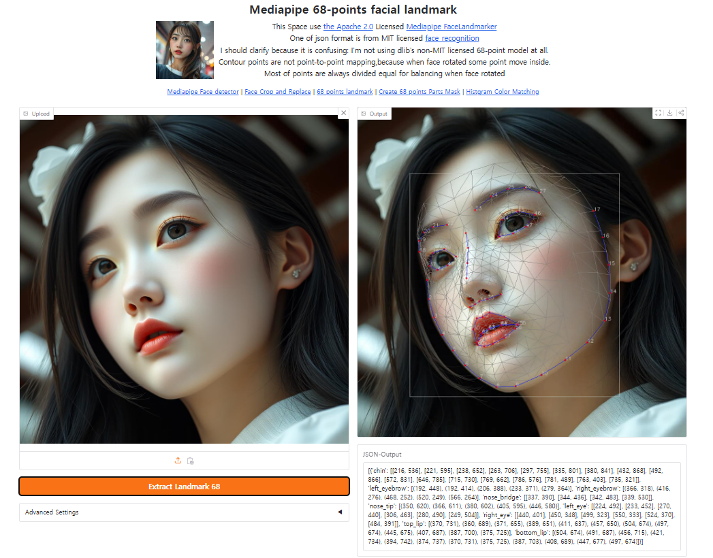 |<br><p>모델이 태도를 직접 판단하지 않습니다.</p><p>얼굴 Feature를 **수치화 → 서비스 로직에서 해석**하는 구조입니다.</p><p>- **좌우 시선** → 코 위치 기반 계산</p><p>- **아래 보기** → 코–눈 상대 좌표 기반 계산</p><p>- **표정 변화** → 눈썹 이동 벡터 기반 신호 추출</p><p>이를 통해 단순 감정 분류가 아닌,면접 상황에 적합한 **비언어적 태도 지표**를 도출합니다.</p> |

### 2. 하이브리드 문항 출제

- 직무/난이도 기반 고정 기술 질문 **50%**
- 이력서 기반 맞춤형 돌발 질문 **50%**
- 균형 잡힌 심층 평가 구조

<br>

### 3. 면접관 페르소나

- 깐깐한 기술팀장  
- 부드러운 인사담당자  
- 스타트업 CTO  

실제 면접 상황을 반영한 맞춤형 시뮬레이션을 제공합니다.

<br>

### 4. 정밀 평가 리포트

- 평가 지표 기준 항목별 점수
- 종합 피드백
- 강/약점 분석 마크다운 리포트 제공

<br>

### 5. Tavily Web Search API 다중 활용

통합 대시보드(홈) 내:

- AIWORK 플랫폼 **가이드 챗봇**
- 최신 **IT 트렌드 뉴스 요약**

두 영역에 Web RAG를 적용하여 항상 최신 팩트 기반 정보를 제공합니다.

### 6. Third-party API & Data Search

- Tavily Web Search API : 실시간 최신 면접 트렌드 및 기술 뉴스 요약 검색
- OpenAI Realtime API : 실시간 음성 대화 및 웹캠 기반 태도 분석
- HuggingFace API : 웹캠 기반 비언어적 Feature 추출
- 고용24(워크넷) API : 현업 채용 공고 실시가 조회 및 키워드 기반 일자리 매칭 데이터 제공
  - AI 모의면접으로 향상된 면접 스킬을 즉시 실전으로 연결할 수 있도록, 고용24(워크넷) API를 호출해 직무별 최신 채용 동향과 채용 공고를 노출합니다. 사용자의 직무 설정 값에 매칭되는 진짜 기업들의 공고를 바로 확인 가능하게 하여 서비스의 완결성을 높였습니다.

---
<br><br>

## 🧭 사용자 이용 흐름 (User Flow)

0. 회원가입
1. 로그인
2. 이력서 업로드
3. AI 면접 진행
4. 웹캠 기반 태도 분석 수행
5. 평가 지표 기반 평가 리포트 제공
6. 결과가 '내기록'에 누적 저장

<br><br>

# 📂 프로젝트 설계 (Directory Structure)

<div align="center">

## LLM 파이프라인
</div>

```plaintext
User Flow: AI 모의면접 진행 파이프라인
 │
 ├── 1. 면접 환경 설정 및 데이터 전처리 (Initialization & Ingestion)
 │    ├── 사용자 입력: 프론트엔드(Streamlit)에서 직무, 난이도, 페르소나 설정 및 이력서 업로드
 │    ├── MySQL (RDBMS): 신규 면접 세션(Session) 생성 및 고유 식별자(Session ID) 발급
 │    └── ChromaDB (Vector DB): 이력서 텍스트를 400자 청크(Chunk)로 분할 후 임베딩(text-embedding-3-small) 저장
 │
 ├── 2. 다중 모드 면접 실행 (Dual-Mode Interview Execution)
 │    │
 │    ├── [Text Mode] 텍스트 기반 면접
 │    │    ├── 사용자가 채팅창에 답변 텍스트 입력
 │    │    └── 백엔드 평가 엔진 API (`/api/infer/evaluate-turn`) 호출
 │    │
 │    └── [Voice Mode] 실시간 화상/음성 면접
 │         ├── 음성 스트리밍: WebRTC 기반 OpenAI Realtime API로 지연 없는 STT/TTS 통신
 │         └── 비전 태도 분석: 웹캠 이미지를 백엔드로 전송 ➔ Hugging Face 랜드마크 모델로 시선/표정 실시간 추론
 │
 ├── 3. 하이브리드 RAG & AI 추론 엔진 (Hybrid RAG & AI Inference Engine) ← [Core 핵심]
 │    │
 │    ├── Context Retrieval (하이브리드 문맥 검색)
 │    │    ├── 이력서 팩트 체크: ChromaDB에서 지원자의 답변과 연관도 높은 이력서 청크(Top-K) 검색
 │    │    └── 실무 역량 체크: MySQL `question_pool`에서 선택한 직무/난이도에 맞는 고정 기술 질문 혼합
 │    │
 │    ├── LLM Evaluation (실시간 답변 채점 및 꼬리질문 제어)
 │    │    ├── 4가지 평가 지표(정확성, 깊이, 구조, 명확성) 기준 및 JSON 스키마를 적용하여 답변 채점
 │    │    └── [Hallucination Control] 환산 점수 40점 이하 시 ➔ 이력서 기반 날카로운 꼬리질문 즉시 생성 (최대 2회 제한)
 │    │
 │    └── 트랜잭션 로깅 (Data Integrity)
 │         └── 매 턴(Turn)마다 주고받은 질문, 답변, 평가 점수, 피드백을 MySQL `interview_details` 테이블에 실시간 무결성 저장
 │
 └── 4. 면접 종료 및 결과 분석 (Termination & Analytics)
      ├── 종료 감지: 지정된 문항 수 도달 시 AI가 `[INTERVIEW_END]` 시그널 송출
      ├── 성과 집계: 백엔드에서 전체 턴의 평균 점수 계산 및 세션 상태 'COMPLETED' 업데이트 (DB 동기화)
      ├── 리포트 생성: LLM이 세션 전체 로그를 종합 분석하여 강/약점 도출 마크다운 리포트 작성
      └── 마이페이지 렌더링: Streamlit Native 모달(Modal) 창을 통해 사용자에게 최종 결과표 및 백분위 데이터 제공
```

<div align="center">

## 시스템 아키텍쳐

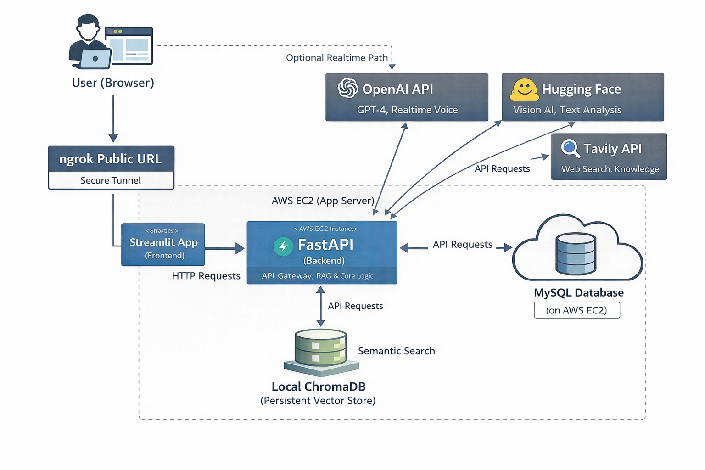

</div>

<div align="center">

## 파일 구조
</div>

```plaintext
👾 SKN23-3rd-1TEAM/
├── README.md                               # 메인 프로젝트 소개 문서
├── requirements.txt                        # Python 라이브러리 의존성 목록
├── .env                                    # 루트 환경변수 파일
├── ai/                                     # LangGraph 기반 면접 흐름/평가 로직
│   ├── graph.py                            # 면접 상태 그래프 정의
│   ├── infer_adapter.py                    # 백엔드와 AI 그래프 연결 어댑터
│   ├── prompts.py                          # 평가/질문 생성 프롬프트 모음
│   └── state.py                            # LangGraph 상태 객체 정의
├── backend/                                # FastAPI 기반 백엔드 서버
│   ├── app.py                              # 백엔드 애플리케이션 생성 및 라우터 등록
│   ├── .env                                # 백엔드 전용 환경변수 파일
│   ├── api/                                # 버전형 API 엔드포인트 모음
│   │   └─ v1/
│   │      └─ endpoints/
│   │          ├─ jobs_api.py               # 채용 공고 API
│   │          └─ resume_api.py             # 이력서 분석/조회 API
│   ├── core/                               # 보안, 설정, 레이트 리밋 등 코어 모듈
│   │   ├── config.py                       # 환경설정 로딩
│   │   ├── rate_limit.py                   # 요청 제한 로직
│   │   └── security.py                     # JWT/보안 유틸
│   ├── db/                                 # DB 연결 및 SQL 보조 로직
│   │   ├── base.py                         # 주요 ORM 테이블 정의
│   │   ├── database.py                     # PyMySQL 기반 DB 유틸 함수
│   │   ├── schema_patch.py                 # 누락 컬럼 보정 스크립트
│   │   └── session.py                      # SQLAlchemy 세션/엔진 설정
│   ├── models/                             # 인증 관련 ORM 모델
│   │   ├── loader.py                       # 모델 로더
│   │   ├── refresh_token.py                # 리프레시 토큰 모델
│   │   └── user.py                         # 사용자 모델
│   ├── routers/                            # FastAPI 라우터(Controller)
│   │   ├── admin.py                        # 관리자 기능 라우터
│   │   ├── attitude.py                     # 웹캠 태도 분석 라우터
│   │   ├── auth.py                         # 일반 인증 라우터
│   │   ├── home.py                         # 홈/대시보드 라우터
│   │   ├── infer.py                        # 면접 세션/추론/음성 처리 라우터
│   │   ├── interview.py                    # 면접 기록 관리 라우터
│   │   ├── jobs.py                         # 채용 공고 라우터
│   │   └── social_auth.py                  # 소셜 로그인 라우터
│   ├── schemas/                            # Pydantic 요청/응답 스키마
│   │   ├── attitude_schema.py              # 태도 분석 스키마
│   │   ├── auth_schema.py                  # 인증 스키마
│   │   ├── infer_schema.py                 # 면접 추론 스키마
│   │   └── jobs_schema.py                  # 채용 공고 스키마
│   ├── scripts/                            # 운영/관리용 스크립트
│   │   ├── create_admin.py                 # 관리자 계정 생성
│   │   ├── patch_db.py                     # DB 패치 실행
│   │   └── python_question.py              # 질문 데이터 적재/가공
│   └── services/                           # 핵심 비즈니스 로직 계층
│       ├── attitude_metrics_service.py     # 태도 지표 계산
│       ├── attitude_service.py             # 태도 분석 처리
│       ├── auth_service.py                 # JWT 발급/검증
│       ├── hf_landmark_service.py          # 얼굴 랜드마크 추론
│       ├── jobs_service.py                 # 채용 공고 가공/호출
│       ├── llm_service.py                  # LLM 평가/질문 생성
│       ├── local_inference.py              # 로컬 STT/TTS 추론
│       ├── rag_service.py                  # ChromaDB 기반 RAG 서비스
│       ├── resume_service.py               # 이력서 조회 보조 로직
│       ├── social_service.py               # 카카오/구글/네이버 OAuth 처리
│       └── tavily_service.py               # Tavily 검색 연동
├── chroma_db/                              # 로컬 ChromaDB 저장소
├── frontend/                               # Streamlit 기반 프론트엔드 앱
│   ├── app.py                              # 프론트엔드 최상위 진입점
│   ├── .env                                # 프론트엔드 환경변수 파일
│   ├── api/                                # 프론트 전용 API 래퍼
│   │   └── jobs.py                         # 채용 공고 API 호출
│   ├── assets/                             # 정적 파일(이미지, 로고 등)
│   ├── components/                         # 재사용 UI 컴포넌트
│   │   └── job_cards.py                    # 채용 공고 카드 UI
│   ├── pages/                              # Streamlit 멀티페이지 화면
│   │   ├── admin.py                        # 관리자 대시보드
│   │   ├── find_pw.py                      # 비밀번호 찾기
│   │   ├── home.py                         # 메인 홈/통합 대시보드
│   │   ├── interview.py                    # 메인 면접 진행 화면
│   │   ├── interview2.py                   # 대체/실험용 면접 화면
│   │   ├── login.py                        # 로그인 화면
│   │   ├── my_info.py                      # 내 정보 수정 화면
│   │   ├── mypage.py                       # 면접 기록/리포트 조회
│   │   ├── resume.py                       # 이력서 등록 및 분석 화면
│   │   └── sign_up.py                      # 회원가입 화면
│   ├── services/                           # 프론트 서비스 레이어
│   │   └── jobs_service.py                 # 채용 공고 데이터 가공
│   └── utils/                              # 설정 및 공통 유틸리티
│       ├── admin_settings.yaml             # 관리자 설정 파일
│       ├── api_utils.py                    # 백엔드 통신 헬퍼
│       ├── aws_utils.py                    # S3 업로드/관리 유틸
│       ├── config.py                       # 프론트 환경설정
│       ├── db_utils.py                     # 프론트 측 DB 보조 유틸
│       ├── function.py                     # 공통 헤더/페이지 보완 로직
│       ├── home_api_render.py              # 홈 대시보드 렌더링 유틸
│       ├── ssh_utils.py                    # 원격 서버 접속 유틸
│       └── webcam_box/                     # 웹캠 컴포넌트 관련 코드
├── static/                                 # 정적 서빙 리소스
└── webcam_component/                       # 별도 웹캠 컴포넌트 디렉터리

```


<br><br>

# 📄 데이터셋 (Dataset)

* **직무별 면접 질문 풀 (MySQL DB):** Python, Java, AI/ML 등 직무 및 난이도별(상/중/하) 초기 기술 질문 데이터셋

* **사용자 맞춤형 컨텍스트 (ChromaDB):** 사용자가 업로드한 이력서를 400자 단위 청크로 분할 후 OpenAI 임베딩(`text-embedding-3-small`)을 거친 벡터 데이터

* **면접 세션 및 평가 로그 (MySQL DB):** 턴(Turn)별 질문, 답변, 평가 점수, 피드백을 누적 저장하는 트랜잭션 데이터셋

<br><br>

# 💡 시연 이미지
### ✧ **로그인**

| **로그인** | **비밀번호 찾기** | **회원가입** |
| --- | --- | --- |
| 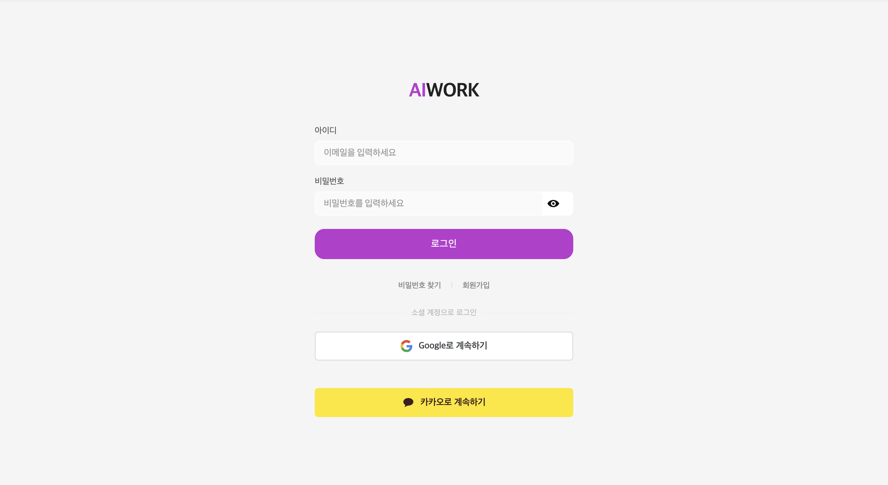 | 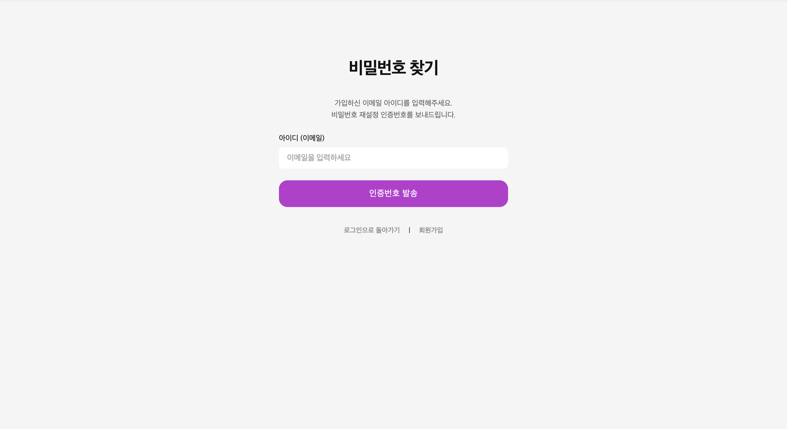 | 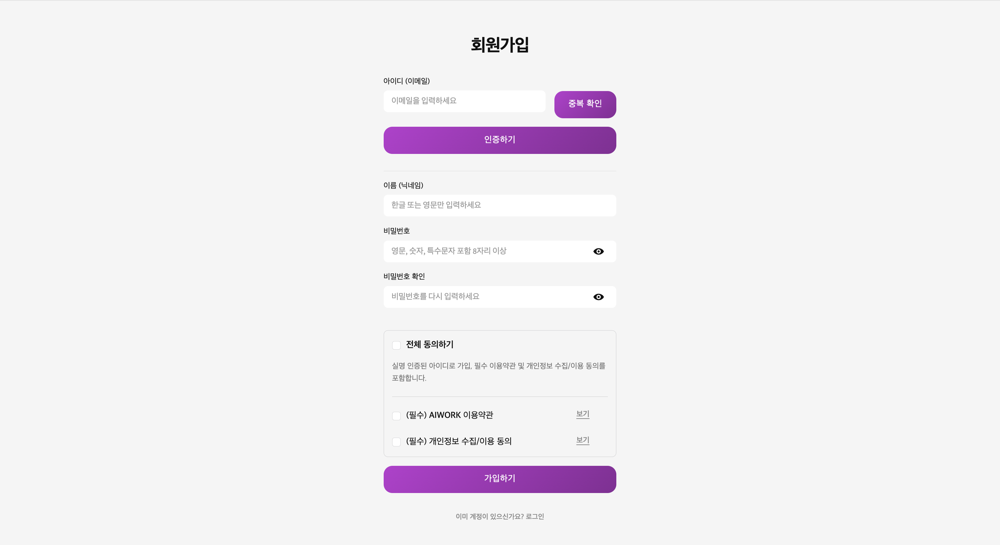 |
| **이메일 인증(pw)** | **이메일 인증(sign)** |
| 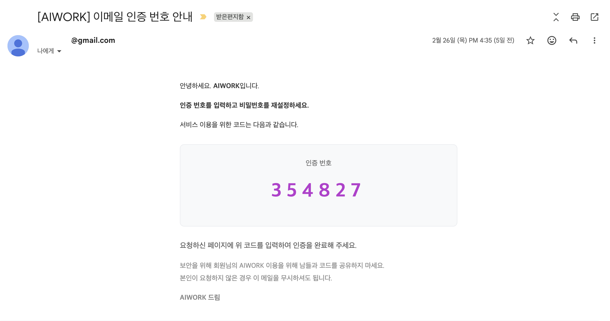 | 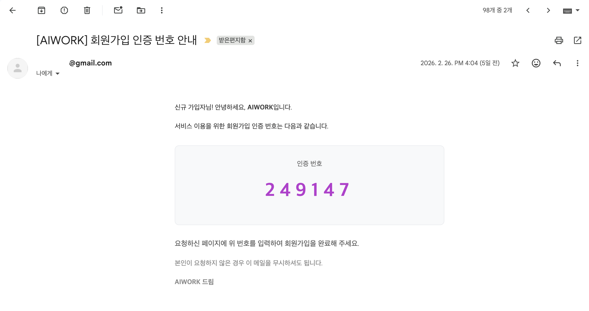 |

### ✧ **Home**

| **홈** | **가이드 챗봇** |
| :--- | :--- |
| 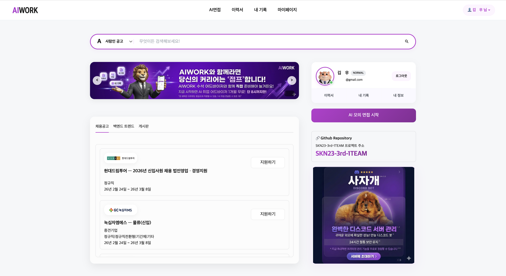 | 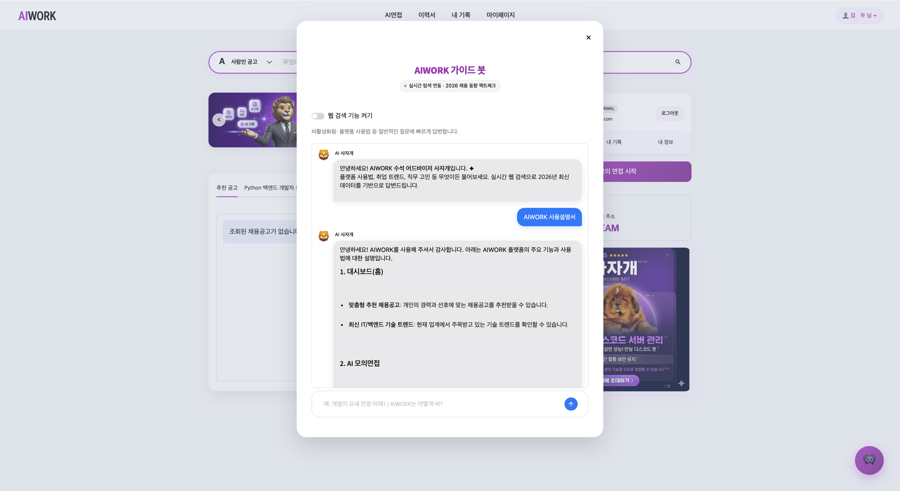 | 

### ✧ **면접**

| **면접 설정** |  | |
| :--- | :--- | :--- |
| 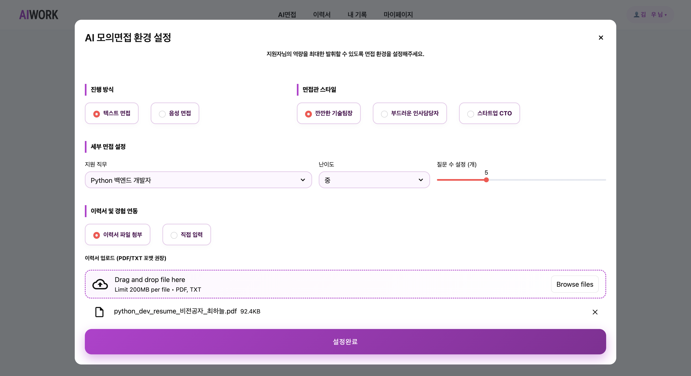 | || 
| **면접 진행(Text)** | **면접 진행(TTS)** |
| 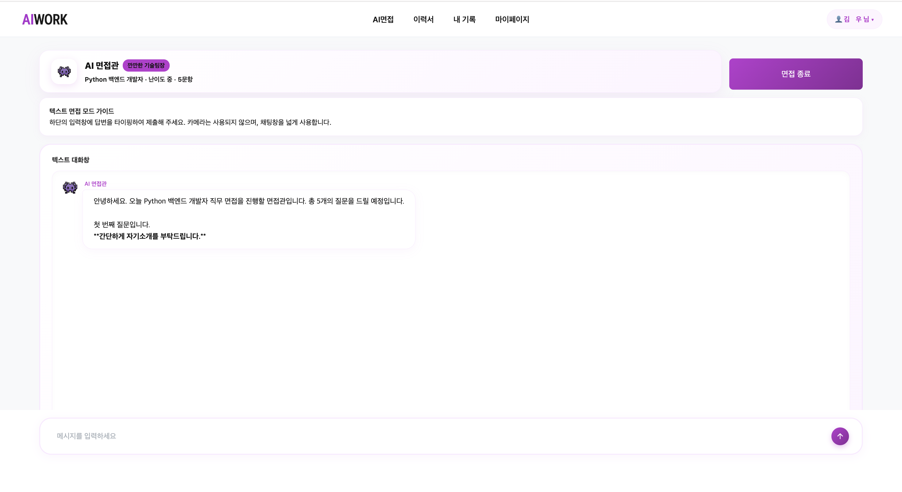 | 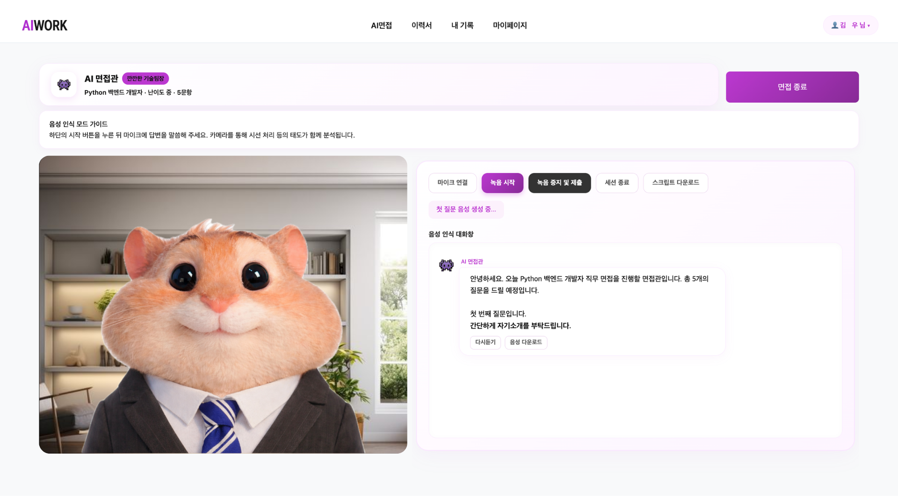 |
| **면접 결과** | |
| 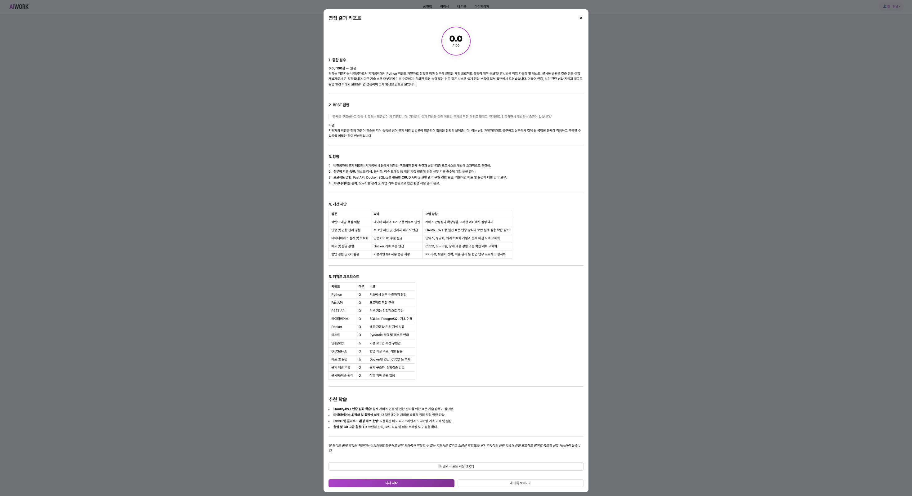 | |

### ✧ **면접 기록**

| **면접 기록** | **면접 상세보기** |
| :--- | :--- |
| 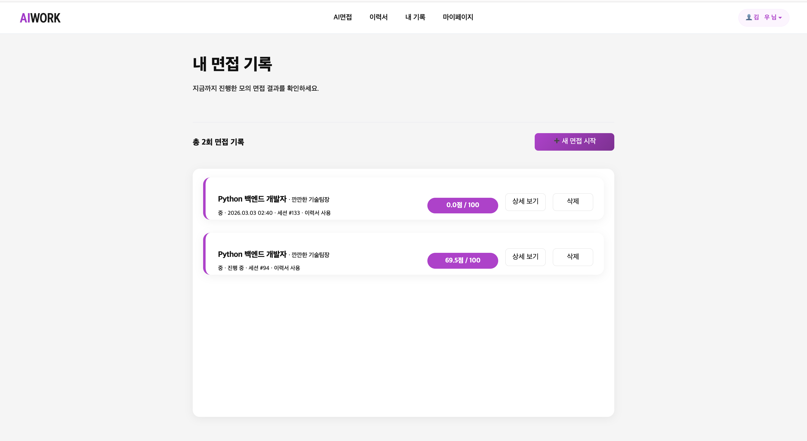 | 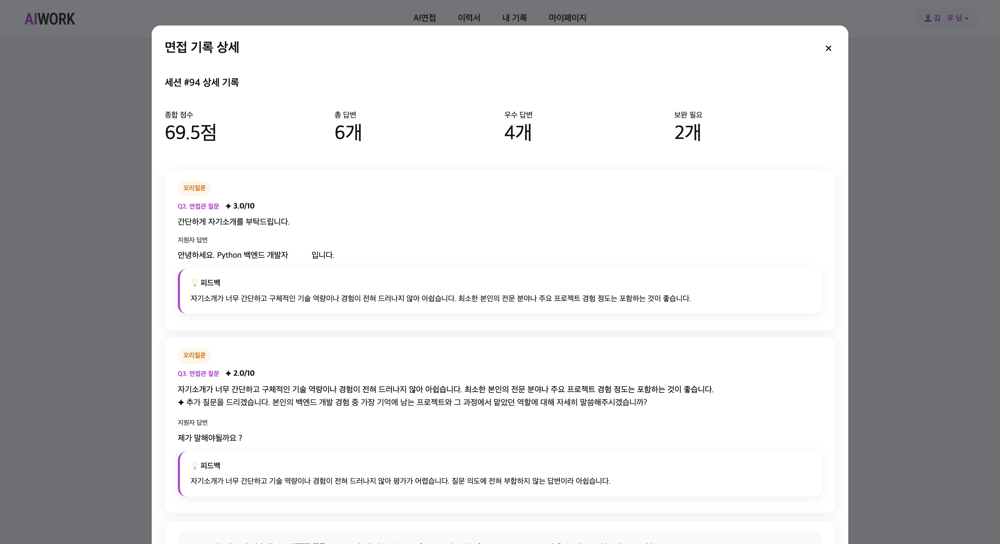 |

### ✧ **이력서**

| **이력서** | **이력서 등록** | |
| :--- | :--- | :--- |
| 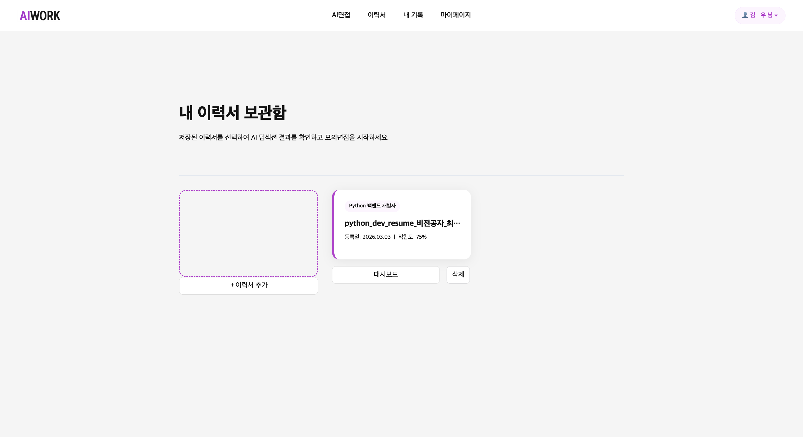 | 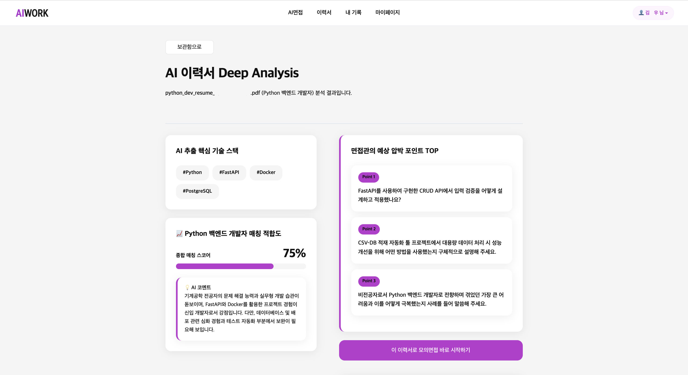 | |

### ✧ **내 정보 수정**

| **내 정보 수정** | |
| :--- | :--- |
| 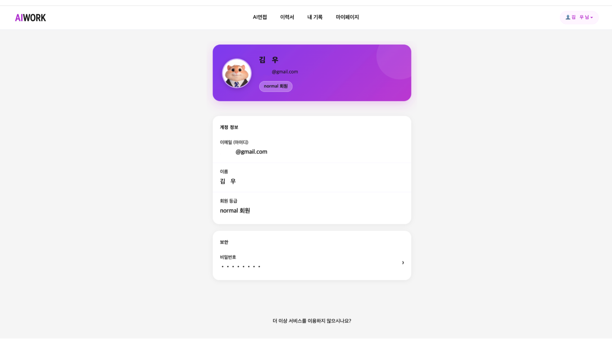 | |

<br><br>

# 🛠️ 기술 스택 (Tech Stack)

### ✦ Languages & Frameworks

  

### ✦ AI & LLM Engine

  

### ✦ Database & Data Processing

  


<br><br>


# 🚀 Trouble Shooting 

<br>

## 1. AI & RAG 파이프라인

### ✦ 이력서를 무시하는 AI 동문서답 현상 (RAG 연동 오류)

* **문제 상황:** 사용자가 이력서를 정상적으로 업로드했음에도, 텍스트 면접 시 AI가 이력서 내용을 읽지 못하고 일반적인 질문만 반복함.
* **원인:** 프론트엔드에서 텍스트 챗봇 데이터를 넘길 때, 과거 레거시 로직(`/infer/ask`)을 타면서 벡터 DB 검색의 키값이 되는 `session_id`와 `resume_text` 페이로드가 누락됨.
* **해결 방안:** 통신 경로를 최신 RAG 평가 엔진(`/api/infer/evaluate-turn`)으로 직통 연결하고, 고유 식별자(`user_id` = `db_session_id`)를 정확히 매핑하여 **이력서 기반 맞춤형 꼬리질문이 100% 작동하도록 파이프라인 통일.**

### ✦ AI 면접 문항 편향성 문제 (Hybrid Question Mix 도입)

* **문제 상황:** 이력서를 첨부할 경우, 모든 면접 문항이 이력서 기반의 경험 위주 질문으로만 편향되어 지원 직무의 핵심 IT 하드 스킬(CS 등) 검증이 누락됨.
* **해결 방안:** 하이브리드 문항 혼합 알고리즘을 구현. 전체 문항의 50%는 이력서 기반 경험 질문으로, 나머지 50%는 DB에 적재된 직무 기반 고정 질문으로 동적 혼합 출제되도록 리팩터링.

<br>

## 2. 프론트엔드 및 데이터 무결성

### ✦ 조용한 에러(Silent Failure)와 무한 로딩 해결

* **문제 상황:** 채팅 입력 후 엔터를 치면 메시지가 전송되지 않고 입력창만 초기화되며 화면이 먹통이 됨.
* **원인:** 백엔드 필수 파라미터(`attitude: None`) 누락으로 422 에러가 발생했으나, 예외 처리 직후 `st.rerun()`이 무조건 실행되어 사용자가 에러 로그를 보기도 전에 화면이 덮어씌워짐.
* **해결 방안:** API 호출 함수 리턴 타입을 Boolean으로 변경. 통신 실패 시 `return False`를 통해 `st.rerun()` 실행을 차단하여 즉각적인 에러 트래킹이 가능한 **방어 로직(Defensive Programming) 구축.**

### ✦ 면접 세션 및 디테일 로그 DB 누락 문제

* **문제 상황:** 면접을 진행했음에도 DB에 핵심 정보(`user_id`, `total_score`)가 누락됨.
* **해결 방안:** 프론트엔드의 JWT 토큰 키워드를 통일하고 페이로드를 정확히 매핑. 종료 시 서버 시간(`func.now()`) 삽입 로직을 추가하여 **트랜잭션 기록의 100% 무결성 확보.**

## 3. 인프라 및 네트워크 아키텍처

### ✦ 브라우저 마이크 권한 차단 (Ngrok HTTPS 도입)

* **문제 상황:** 실시간 음성 면접 구현 시, 브라우저 보안 정책상 `http://` 환경에서는 WebRTC 권한이 차단됨. 무료 Ngrok 사용 시 서버 재구동마다 도메인이 변경됨.
* **해결 방안:** Ngrok 유료 플랜을 도입하여 **고정된 HTTPS Custom Domain** 확보. 프론트엔드 환경변수 수정 공수를 완전히 제거함.

### ✦ 로컬 분산 DB로 인한 데이터 파편화

* **문제 상황:** 팀원들이 개별 로컬 MySQL을 사용하여 데이터가 불일치하고 통합 테스트가 불가능함.
* **해결 방안:** AWS EC2에 공용 MySQL 서버를 구축하고, 모든 팀원이 하나의 **원격 공유 DB**를 바라보도록 아키텍처 전면 전환. (동적 RBAC 권한 분리 적용 완료)

<br><br>

# 💡 Insight

이번 프로젝트를 통해 "**진정한 AI SaaS는 UI에 챗봇 하나 띄워두는 것이 아님**"을 깊이 체감했습니다.  
기존에는 기능 제공형 도구를 만들고 AI를 보조 수단으로 붙였다면, 이번에는 **AI(RAG 엔진과 평가 로직)를 서비스의 핵심 엔진으로 설계하고, 그 위에 마이페이지와 세션 관리 등의 SaaS 구조를 구축하는 방식**으로 아키텍처의 패러다임을 전환했습니다.

이 과정에서 프론트엔드의 상태 관리(Session State)와 백엔드의 복잡한 AI 추론 API 간의 명확한 역할 분리 및 에러 핸들링이 서비스의 완성도를 결정짓는 핵심 요소임을 배웠습니다.

또한 본 시스템은 향후 자연어 기반 인터랙션을 통해 AI가 면접 흐름을 설계하는 Agent형 SaaS로 확장될 가능성을 지니고 있습니다.

나아가 기업 채용 과정에서 초기 역량 검증을 지원하는 AI 면접 보조 도구로 활용될 수 있는 방향성도 확인할 수 있었습니다.

<br><br>

# ✏️ 한 줄 회고

* **양창일 (팀장)**
> (공백)


* **김다빈 (팀원)**
> (공백)


* **김지우 (팀원)**
> (공백)


* **유헌상 (팀원)**
> (공백)

<br><br>

# 📚 Industry Insight

최근 업계에서는 **AI 에이전트의 등장으로 기존 SaaS 구조가 변화할 것이라는 전망**이 제기되고 있습니다.

특히, AI가 사용자의 업무 흐름을 직접 수행하는 방향으로 발전함에 따라  
**기존의 기능 중심 SaaS는 점차 재편될 가능성이 있다는 논의**가 이어지고 있습니다.

본 프로젝트는 이러한 흐름 속에서 AI가 단순 도구가 아닌 **평가 및 상호작용 주체로 작동하는 SaaS 구조를 실험적으로 구현하는 것을 목표**로 합니다.

  ### ✦ AI SaaS의 변화 흐름
  - https://www.threads.net/@choi.openai/post/DUh_-_DD3V0
  - https://www.youtube.com/watch?v=4uzGDAoNOZc