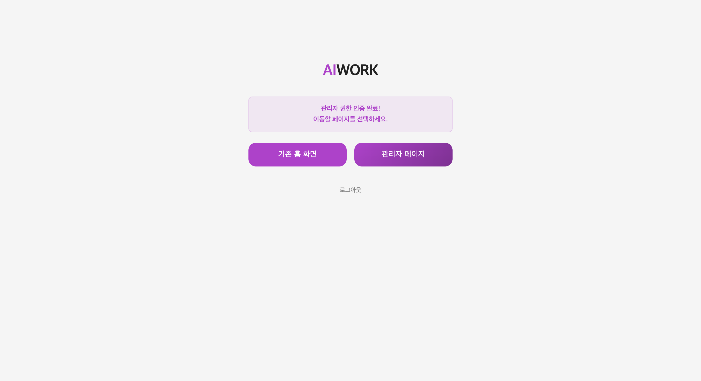
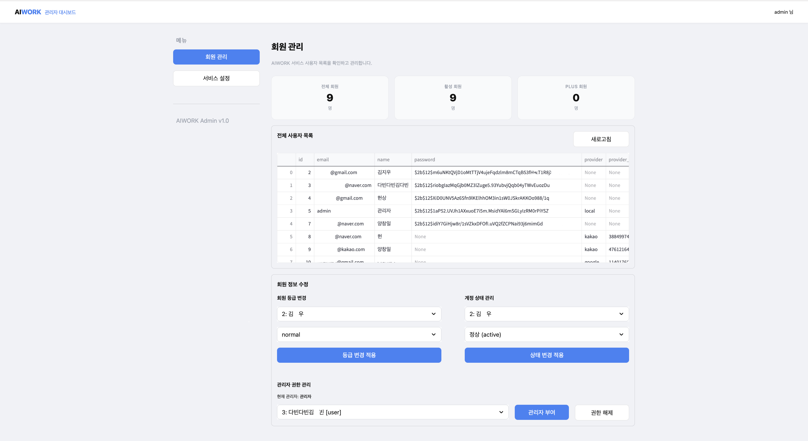

# 👾 AIWORK — 차세대 AI 주도형 면접 SaaS

<br>

# 👥 팀 소개

## ✦ 팀명 : **사자개와 아이들**

|                                                  양창일                                                   |                                                 김다빈                                                  |                                                 김지우                                                 |                                                     유헌상                                                      |
| :-------------------------------------------------------------------------------------------------------: | :-----------------------------------------------------------------------------------------------------: | :----------------------------------------------------------------------------------------------------: | :-------------------------------------------------------------------------------------------------------------: |
|                                                 **팀장**                                                  |                                                **팀원**                                                 |                                                **팀원**                                                |                                                    **팀원**                                                     |
|                                            PM & 아키텍처 설계                                             |                                  클라우드 인프라 & DevOps & 프론트엔드                                  |                              AI 파이프라인 (RAG & Vector DB) & 프론트엔드                              |                               백엔드 개발 & 외부 API 연동 및 프롬프트 엔지니어링                                |
| [](https://github.com/clachic00) | [](https://github.com/tree0327) | [](https://github.com/jooooww) | [](https://github.com/hunsang-you) |

<br><br>

# 📄 프로젝트 개요 (Overview)

> _"소프트웨어가 세상을 집어삼키던 시대는 끝났다. 이제 AI가 소프트웨어를 집어삼킬 것이다."_

최근 IT 업계에서는 **"기존 SaaS의 80%가 도태될 것"** 이라는 위기론이 확산되고 있습니다. 사용자는 더 이상 복잡한 기능을 클릭하며 직접 학습해야 하는 수동적 도구를 원하지 않습니다. 이제 사용자는 자신의 목표 달성을 위해 먼저 고민하고 과정을 이끌어주는 **능동적인 AI 파트너** 를 원합니다.

**AIWORK** 는 이 지점에서 출발했습니다. 기능만 나열한 플랫폼이 아니라, **AI가 시스템의 심장부에서 사용자의 취업 여정을 직접 이끌어주는 차세대 AI 지원형 SaaS** 입니다.

## ✦ 프로젝트 소개

**AIWORK** 는 표준화된 SaaS 아키텍처(로그인 · 회원 등급 · 대시보드) 위에 **RAG 기반 AI 면접관** 을 핵심으로 결합한 서비스입니다. 사용자의 이력서를 분석해 실전과 같은 압박 꼬리질문을 생성하고, 4가지 평가 지표에 기반한 정밀한 성과 리포트를 제공합니다.

> **프로젝트 기간:** 2026.02.27(금) ~ 2026.03.21(토)

<br>

# 📋 필수 산출물

<br>

## <span style="color:#0176f7;">1. 요구사항 정의서</span>

### 기능 요구사항

|  ID   |   구분    | 요구사항                                                      | 우선순위 |
| :---: | :-------: | ------------------------------------------------------------- | :------: |
| FR-01 | 회원 관리 | 이메일 회원가입 및 이메일 인증                                |    상    |
| FR-02 | 회원 관리 | JWT 기반 로그인 (Access 30분 + Refresh 14일 httpOnly 쿠키)    |    상    |
| FR-03 | 회원 관리 | Kakao · Google · Naver OAuth 2.0 소셜 로그인                  |    상    |
| FR-04 | 회원 관리 | 이메일 인증 코드 기반 비밀번호 찾기 · 재설정                  |    중    |
| FR-05 | 회원 관리 | 회원 등급(Tier) 기반 기능 접근 제어                           |    중    |
| FR-06 |  이력서   | PDF 이력서 업로드 및 텍스트 추출                              |    상    |
| FR-07 |  이력서   | 이력서 텍스트 400자 청크 분할 → ChromaDB 벡터 임베딩 저장     |    상    |
| FR-08 |  이력서   | LLM 기반 이력서 AI 분석 리포트 생성                           |    중    |
| FR-09 | 면접 설정 | 직무 · 난이도(상/중/하) · 면접관 페르소나 수동 선택           |    상    |
| FR-10 | 면접 설정 | 자연어 명령 기반 LUI 자동 면접 세팅 (OpenAI Function Calling) |    상    |
| FR-11 | 면접 진행 | 채팅 기반 텍스트 면접                                         |    상    |
| FR-12 | 면접 진행 | WebRTC + OpenAI Realtime API 기반 실시간 음성 면접            |    상    |
| FR-13 | 면접 진행 | 이력서 50% + 직무 질문 풀 50% 하이브리드 RAG 문항 출제        |    상    |
| FR-14 | 면접 진행 | 4가지 평가 지표(정확성·깊이·구조·명확성) 기반 답변 채점       |    상    |
| FR-15 | 면접 진행 | 점수 40점 이하 시 꼬리질문 자동 생성 (최대 2회)               |    상    |
| FR-16 | 면접 진행 | 웹캠 HuggingFace 랜드마크 모델 기반 비언어적 태도 분석        |    중    |
| FR-17 |   결과    | 면접 종료 후 마크다운 종합 리포트 자동 생성                   |    상    |
| FR-18 |   결과    | 면접 기록 마이페이지 누적 저장 및 상세 조회                   |    상    |
| FR-19 | 대시보드  | Tavily API 연동 가이드 챗봇 (최신 면접 트렌드 실시간 응답)    |    중    |
| FR-20 | 대시보드  | 고용24(워크넷) API 연동 직무 맞춤 채용 공고 실시간 조회       |    중    |
| FR-21 | 대시보드  | Tavily 기반 최신 IT 뉴스 요약 피드 제공                       |    중    |
| FR-22 |  관리자   | 관리자 전용 로그인 및 사용자 관리 대시보드                    |    하    |

### 비기능 요구사항

|   ID   |   구분   | 요구사항                                                         |
| :----: | :------: | ---------------------------------------------------------------- |
| NFR-01 |   보안   | JWT Access/Refresh Token 이중 인증 체계                          |
| NFR-02 |   보안   | CSRF 이중 쿠키 검증 패턴 (Double Submit Cookie)                  |
| NFR-03 |   보안   | 모든 AI API 키 백엔드 서버 경유 처리 (클라이언트 노출 원천 차단) |
| NFR-04 |   성능   | 텍스트 면접 LLM 응답 5초 이내                                    |
| NFR-05 |   성능   | 음성 면접 STT/TTS 실시간 처리 (WebRTC Realtime API)              |
| NFR-06 |  인프라  | AWS EC2 공용 MySQL 서버로 팀원 전체 공유 DB 운영                 |
| NFR-07 |  인프라  | Ngrok 유료 플랜 고정 HTTPS 도메인으로 WebRTC 마이크 권한 확보    |
| NFR-08 |  확장성  | 회원 등급제(Tier) 시스템 내장으로 프리미엄 수익화 전환 가능 구조 |
| NFR-09 | 유지보수 | LangGraph StateGraph 기반 AI 파이프라인 모듈화                   |
| NFR-10 | 유지보수 | 3계층 아키텍처 (React ↔ Django ↔ DB/AI) 명확한 역할 분리         |

<br>

## <span style="color:#0176f7;">2. 화면설계서</span>

### ✧ 인증 (로그인 · 회원가입 · 비밀번호 찾기)

|       화면        |                     스크린샷                     | 구성 요소                                                                                                 | 사용자 흐름                                                |
| :---------------: | :----------------------------------------------: | --------------------------------------------------------------------------------------------------------- | ---------------------------------------------------------- |
|    **로그인**     |           | 이메일/비밀번호 입력 필드, 로그인 버튼, 소셜 로그인 (Kakao · Google · Naver), 회원가입/비밀번호 찾기 링크 | 이메일+비밀번호 입력 → JWT 발급 → 홈 이동                  |
| **비밀번호 찾기** |  | 이메일 입력, 인증코드 발송 버튼, 인증코드 입력, 새 비밀번호 입력                                          | 이메일 입력 → 인증코드 수신 → 코드 확인 → 새 비밀번호 설정 |
|   **회원가입**    |       | 이름/이메일/비밀번호/직무 입력 필드, 이메일 인증 버튼, 가입 완료 버튼                                     | 정보 입력 → 이메일 인증 → 가입 완료 → 로그인 이동          |

### ✧ 메인 대시보드

|      화면       |                       스크린샷                       | 구성 요소                                                                                       | 사용자 흐름                                                            |
| :-------------: | :--------------------------------------------------: | ----------------------------------------------------------------------------------------------- | ---------------------------------------------------------------------- |
|     **홈**      |                    | 상단 헤더(네비게이션), 가이드 챗봇 위젯, 직무 맞춤 채용 공고 카드, IT 뉴스 피드, 면접 시작 버튼 | 홈 접속 → 채용 공고/뉴스 확인 → 면접 시작 또는 챗봇으로 자동 세팅      |
| **가이드 챗봇** |  | 채팅 입력창, AI 응답 버블, Zero-Click 면접 세팅 자동 완성                                       | 자연어 입력 → LUI 파라미터 추출 → 면접 설정 자동 주입 → 면접 화면 이동 |

### ✧ 면접 설정 및 진행

|         화면         |                        스크린샷                         | 구성 요소                                                                                                     | 사용자 흐름                                                   |
| :------------------: | :-----------------------------------------------------: | ------------------------------------------------------------------------------------------------------------- | ------------------------------------------------------------- |
|    **면접 설정**     |   | 직무 선택 드롭다운, 난이도(상/중/하) 선택, 면접관 페르소나 선택, 이력서 연동 토글, 면접 모드(Text/Voice) 선택 | 설정 완료 → 면접 시작                                         |
|   **텍스트 면접**    |    | AI 면접관 질문 버블, 사용자 답변 입력창, 전송 버튼, 면접 종료 버튼                                            | AI 질문 수신 → 텍스트 답변 입력 → 제출 → LLM 평가 → 다음 질문 |
| **음성 면접 + 웹캠** |       | 웹캠 영상 뷰, 음성 파형 시각화, 실시간 STT 자막, 태도 분석 인디케이터                                         | 마이크/웹캠 활성화 → 음성 답변 → Realtime API 실시간 평가     |
| **면접 결과 리포트** |  | 4축 평가 점수 (정확성·깊이·구조·명확성), 총점, 항목별 피드백, 강점/약점 마크다운 분석                         | 면접 종료 → 리포트 자동 생성 → 결과 확인 → 마이페이지 저장    |

### ✧ 마이페이지 · 이력서

|        화면        |                       스크린샷                       | 구성 요소                                                | 사용자 흐름                                     |
| :----------------: | :--------------------------------------------------: | -------------------------------------------------------- | ----------------------------------------------- |
|   **면접 기록**    |          | 면접 기록 리스트 (날짜·직무·총점), 필터링, 상세보기 버튼 | 기록 목록 확인 → 상세보기 클릭                  |
| **면접 상세보기**  |     | 면접 세션별 Q&A 목록, 문항별 점수, 종합 리포트           | 면접별 상세 피드백 확인                         |
|  **이력서 관리**   |              | 이력서 업로드 버튼, 등록 이력서 목록, 삭제 버튼          | PDF 업로드 → ChromaDB 임베딩 → 면접에 자동 연동 |
| **이력서 AI 분석** |  | LLM 분석 결과 마크다운, 강점 요약, 개선 제안             | 이력서 선택 → AI 분석 요청 → 분석 리포트 확인   |

### ✧ 관리자 페이지

|       화면        |                       스크린샷                       | 구성 요소                                                    | 사용자 흐름                             |
| :---------------: | :--------------------------------------------------: | ------------------------------------------------------------ | --------------------------------------- |
| **관리자 로그인** |  | 관리자 전용 이메일/비밀번호 입력, 로그인 버튼                | 관리자 계정 로그인 → 관리 대시보드 이동 |
|  **관리자 설정**  |  | 사용자 목록, 계정 활성화/비활성화, 등급 변경, 면접 기록 통계 | 사용자 관리 및 시스템 모니터링          |

<br>

## <span style="color:#0176f7;">3. 개발된 LLM 연동 웹 애플리케이션</span>

<span style="color:#0176f7;">AIWORK는 OpenAI GPT-4o 및 다중 AI 서비스를 LangGraph StateGraph 파이프라인에 통합한 LLM 연동 웹 애플리케이션입니다. 단순 챗봇 임베딩이 아닌, AI가 면접 출제 → 평가 → 꼬리질문 생성의 전 과정을 주도하는 AI-Native 구조로 설계되었습니다.</span>

### LLM 연동 포인트

| 기능                       | 모델 / API                | 연동 방식                                             | 담당 모듈                                       |
| -------------------------- | ------------------------- | ----------------------------------------------------- | ----------------------------------------------- |
| 면접 질문 생성 · 답변 평가 | GPT-4o                    | LangGraph StateGraph 노드, JSON Schema 출력 강제      | `backend/ai/graph.py` `backend/ai/evaluator.py` |
| 이력서 벡터 임베딩         | text-embedding-3-small    | 400자 청크 → ChromaDB 저장, 면접 시 Top-K 유사도 검색 | `backend/services/rag_service.py`               |
| 실시간 음성 면접           | OpenAI Realtime API       | WebRTC DataChannel 스트리밍, STT/TTS 지연 없는 처리   | `frontend/src/hooks/useWebRTC.ts`               |
| LUI 자동 면접 세팅         | GPT-4o (Function Calling) | 자연어 발화 → JSON 파라미터 추출 → Zustand Store 주입 | `backend/ai/agent.py`                           |
| 이력서 AI 분석 리포트      | GPT-4o                    | 청크 컨텍스트 기반 강점/약점 분석 리포트 생성         | `backend/services/llm_service.py`               |
| 가이드 챗봇                | GPT-4o + Tavily Search    | Web RAG 기반 최신 면접 트렌드 실시간 응답             | `backend/django_api/views.py` (`home_guide`)    |
| 웹캠 태도 분석             | HuggingFace 랜드마크 모델 | 이미지 → 랜드마크 수치 추출 → 서비스 레이어 해석      | `backend/services/hf_landmark_service.py`       |

### 주요 API 엔드포인트

| 엔드포인트                  |   메서드   | 설명                                                    |
| --------------------------- | :--------: | ------------------------------------------------------- |
| `/api/infer/start`          |    POST    | 면접 세션 생성, MySQL `interview_sessions` 레코드 삽입  |
| `/api/infer/evaluate-turn`  |    POST    | 답변 제출 → LangGraph 평가 → 점수/피드백/다음 질문 반환 |
| `/api/infer/sessions/<id>`  | GET/DELETE | 면접 세션 조회 및 종료, 마크다운 리포트 생성            |
| `/api/infer/realtime-token` |    GET     | OpenAI Realtime API WebRTC 세션 토큰 발급               |
| `/api/v1/agent/chat`        |    POST    | LUI 자연어 입력 → Function Calling 파라미터 추출        |
| `/api/infer/ingest`         |    POST    | PDF 업로드 → 텍스트 추출 → ChromaDB 임베딩 저장         |
| `/api/infer/attitude`       |    POST    | 웹캠 이미지 → 랜드마크 추출 → 태도 수치 반환            |

<br>

## <span style="color:#0176f7;">4. 시스템 구성도</span>

### 전체 시스템 아키텍처


### 구성 요소 설명

|      계층      | 컴포넌트                          | 역할                                                             |
| :------------: | --------------------------------- | ---------------------------------------------------------------- |
| **프론트엔드** | React + Vite (Port 5173)          | SPA UI 렌더링, Zustand 전역 상태 관리, Vite Proxy `/api → :8000` |
|   **백엔드**   | Django (Port 8000)                | REST API 뷰, JWT/CSRF 인증, AI 파이프라인 오케스트레이션         |
|  **AI 엔진**   | LangGraph + GPT-4o                | 면접 StateGraph 실행 (질문 선택 → 평가 → 꼬리질문 분기)          |
| **RAG 저장소** | ChromaDB                          | 이력서 청크 벡터 저장, 면접 시 Top-K 유사도 검색                 |
| **관계형 DB**  | MySQL (AWS EC2)                   | 사용자 정보, 면접 세션, 질문 풀, 평가 기록                       |
|  **외부 API**  | OpenAI Realtime / Tavily / 고용24 | 음성 처리, 웹 검색, 채용 공고                                    |
|   **인프라**   | AWS EC2 + Ngrok 유료              | 공용 DB 서버, 고정 HTTPS 도메인 (WebRTC 마이크 권한 확보)        |

<br>

## <span style="color:#0176f7;">5. 테스트 계획 및 결과 보고서</span>

### 테스트 케이스 및 결과

| TC-ID | 기능 영역 | 테스트 시나리오                     | 기대 결과                                      | 실제 결과      |  상태   |
| :---: | :-------: | ----------------------------------- | ---------------------------------------------- | -------------- | :-----: |
| TC-01 | 회원 관리 | 유효한 이메일/비밀번호로 회원가입   | 가입 성공, 이메일 인증 발송                    | 가입 성공      | ✅ PASS |
| TC-02 | 회원 관리 | 이미 가입된 이메일로 재가입 시도    | 중복 이메일 오류 메시지 반환                   | 오류 처리 정상 | ✅ PASS |
| TC-03 | 회원 관리 | Kakao 소셜 로그인                   | OAuth 인증 후 JWT 발급, 홈 이동                | 정상 로그인    | ✅ PASS |
| TC-04 | 회원 관리 | Access Token 만료 후 자동 재발급    | 401 발생 → Refresh → 재요청 자동 처리          | 자동 갱신 정상 | ✅ PASS |
| TC-05 |  이력서   | PDF 이력서 업로드                   | 텍스트 추출 후 ChromaDB 임베딩 저장            | 정상 임베딩    | ✅ PASS |
| TC-06 |  이력서   | AI 분석 리포트 생성 요청            | LLM 기반 강점/약점 마크다운 리포트 반환        | 정상 생성      | ✅ PASS |
| TC-07 | 면접 설정 | LUI 챗봇으로 자연어 면접 세팅       | 파라미터 자동 추출, 면접 화면 이동             | 정상 동작      | ✅ PASS |
| TC-08 | 면접 진행 | 텍스트 면접 — 이력서 연동 질문 생성 | 이력서 기반 맞춤 질문 50% + 고정 질문 50% 출제 | RAG 정상 연동  | ✅ PASS |
| TC-09 | 면접 진행 | 점수 40점 이하 답변 제출            | 꼬리질문 생성 (최대 2회)                       | 꼬리질문 정상  | ✅ PASS |
| TC-10 | 면접 진행 | 점수 40점 초과 답변 제출            | 다음 질문으로 이동 (꼬리질문 없음)             | 정상 동작      | ✅ PASS |
| TC-11 | 면접 진행 | 음성 면접 — WebRTC 연결             | Realtime API 세션 수립, STT 정상 동작          | 정상 연결      | ✅ PASS |
| TC-12 | 면접 진행 | 웹캠 태도 분석                      | 랜드마크 추출, 시선/표정 수치화 정상 처리      | 정상 분석      | ✅ PASS |
| TC-13 |   결과    | 면접 종료 후 리포트 생성            | 마크다운 종합 리포트 생성 + DB 저장            | 정상 생성      | ✅ PASS |
| TC-14 |   결과    | 마이페이지 면접 기록 조회           | 누적 면접 기록 리스트 정상 출력                | 정상 출력      | ✅ PASS |
| TC-15 | 대시보드  | 채용 공고 직무 매칭 조회            | 직무 설정값 기반 고용24 공고 출력              | 정상 출력      | ✅ PASS |
| TC-16 | 대시보드  | 가이드 챗봇 IT 트렌드 질의          | Tavily 검색 기반 실시간 응답                   | 정상 응답      | ✅ PASS |
| TC-17 |   보안    | CSRF 토큰 미포함 요청               | 403 Forbidden 반환                             | 정상 차단      | ✅ PASS |
| TC-18 |   보안    | 인증 없이 보호된 라우트 접근        | 401 반환 후 로그인 페이지 리다이렉트           | 정상 차단      | ✅ PASS |

### 발견된 이슈 및 해결

| 이슈 ID | 기능 영역 | 발견된 문제                                   | 원인                                                                 | 해결 방법                                                            |
| :-----: | :-------: | --------------------------------------------- | -------------------------------------------------------------------- | -------------------------------------------------------------------- |
| BUG-01  | RAG 연동  | 이력서 업로드 후에도 일반 질문만 출제         | 레거시 라우터(`/infer/ask`) 경유 시 `session_id` 누락                | `/api/infer/evaluate-turn`으로 통신 경로 일원화                      |
| BUG-02  | 면접 진행 | 채팅 입력 후 메시지 미전송 및 무한 로딩       | `attitude: None` 누락 → 422 에러 → UI 강제 갱신이 에러 로그 덮어씌움 | API 반환 타입 Boolean으로 변경, 실패 시 `return False`로 재실행 차단 |
| BUG-03  | DB 무결성 | 면접 종료 후 `user_id`, `total_score` DB 누락 | 프론트엔드 JWT 토큰 페이로드 키 불일치                               | 토큰 키워드 통일, 서버 시간(`func.now()`) 삽입 로직 추가             |
| BUG-04  | 음성 면접 | HTTP 환경에서 마이크 권한 차단                | 브라우저 보안 정책 (WebRTC는 HTTPS 필수)                             | Ngrok 유료 플랜 고정 HTTPS 도메인 적용                               |
| BUG-05  |  인프라   | 팀원별 로컬 DB 데이터 불일치                  | 개별 로컬 MySQL 사용으로 통합 테스트 불가                            | AWS EC2 공용 MySQL 서버 구축, 전원 원격 DB 연결                      |

<br>

# 💼 비즈니스 이해 (Business Understanding)

본 프로젝트는 **전형적인 SaaS 비즈니스 모델** 을 기반으로, AI를 통해 사용자 경험의 가치를 극대화하도록 설계되었습니다.

### 1. 타겟 고객 및 가치 제안

**✶ B2C — 구직자 대상 에듀테크 SaaS**

- 이력서 기반 무한 반복 AI 모의 면접 제공
- 면접 전 예상 압박 질문 및 직무 매칭률을 보여주는 **AI 대시보드** 제공
- 문항별 루브릭 평가 기반 피드백 및 마크다운 리포트 제공

### 2. 핵심 비즈니스 전략

| 전략                     | 내용                                                                                           |
| ------------------------ | ---------------------------------------------------------------------------------------------- |
| **사용자 경험 혁신**     | 고비용 1:1 대면 컨설팅을 대체하는 초개인화 AI 면접 경험을 시공간 제약 없이 제공                |
| **락인 효과 (Lock-in)**  | 이력서 청크 · 누적 점수 · 강약점 분석이 마이페이지에 자산처럼 축적되어 지속적 이용 유도        |
| **확장 가능한 아키텍처** | 회원 등급제(Tier) 시스템 내장으로 향후 프리미엄 AI 모델 적용 및 수익화(Monetization) 전환 용이 |

<br>

# 🎯 프로젝트 목표

**1. 차세대 AI 지원형 SaaS 및 Dual DB 아키텍처 구축**

- AI를 단순 부가 기능(Add-on)이 아닌 시스템의 핵심 엔진으로 설계
- **RDBMS (MySQL):** 사용자 세션, 면접 메타데이터, 질문 풀, 평가 기록 관리
- **Vector DB (ChromaDB):** 이력서 텍스트 청크 임베딩 및 AI 문맥 검색

**2. 동적 RAG (Continuous Learning RAG) 구현**

- 지원자의 이력서와 실시간 답변을 맵핑하여 파고드는 **스마트 AI 면접관** 구현
- 이전 답변 맥락을 기억하고 꼬리질문을 던지는 유기적인 면접 흐름 생성

**3. 환각 현상(Hallucination) 통제 및 정교한 AI 제어 로직**

- **JSON Schema + 4가지 평가 지표 (정확성 · 깊이 · 구조 · 명확성)** 기반 프롬프트 엔지니어링
- 답변 환산 점수 40점 이하 시에만 동적 꼬리질문 생성 (최대 2회)

**4. Seamless UX/UI — Zero-Click 네비게이션**

- OpenAI Function Calling 기반 LUI(Language User Interface) 에이전트 구축
- 자연어 한 문장으로 면접 세팅부터 시작까지 자동 처리

**5. 엔터프라이즈급 보안 및 3계층 아키텍처 구축**

- React 프론트엔드와 Django 백엔드를 엄격하게 분리한 Proxy 구조
- 모든 AI API 접근은 백엔드를 경유하여 민감 정보 노출 원천 차단

<br>

# ✨ 주요 기능 (Key Features)

### <span style="color:#0176f7;">1. LUI 기반 Zero-Click 네비게이션</span>

- <span style="color:#0176f7;">OpenAI Function Calling으로 사용자의 자연어 발화에서 **면접 세팅 파라미터(직무 · 난이도 · 페르소나 · 이력서 연동 여부)** 를 자동 추출</span>
- <span style="color:#0176f7;">추출된 파라미터를 프론트엔드 상태(Zustand Store)에 주입하고 즉시 면접 화면으로 강제 전환</span>
- <span style="color:#0176f7;">복잡한 모달 설정을 우회하는 **하이패스(High-pass) 컨트롤러** 구현</span>

### 2. 다중 모드 면접 (Text / Realtime Voice)

| 모드           | 설명                                                                       |
| -------------- | -------------------------------------------------------------------------- |
| **Text Mode**  | 채팅 기반 텍스트 면접, RAG 평가 엔진(`/api/infer/evaluate-turn`) 직결      |
| **Voice Mode** | WebRTC + OpenAI Realtime API 기반 실시간 음성 대화, 지연 없는 STT/TTS 통신 |

<span style="color:#0176f7;">**Realtime Voice — 비언어적 태도 분석**</span>

- <span style="color:#0176f7;">웹캠 이미지를 백엔드로 전송 → HuggingFace 랜드마크 모델로 얼굴 Feature 수치화</span>
- <span style="color:#0176f7;">모델이 태도를 직접 판단하지 않고, **수치화 → 서비스 로직에서 해석** 하는 구조</span>

| 분석 항목     | 측정 방법                     |
| ------------- | ----------------------------- |
| **좌우 시선** | 코 위치 기반 계산             |
| **아래 보기** | 코–눈 상대 좌표 기반 계산     |
| **표정 변화** | 눈썹 이동 벡터 기반 신호 추출 |

### 3. 하이브리드 문항 출제

- 직무/난이도 기반 **고정 기술 질문 50%** (MySQL `question_pool`)
- 이력서 기반 **맞춤형 돌발 질문 50%** (ChromaDB Top-K 검색)
- 균형 잡힌 심층 평가 구조로 CS 지식과 경험 역량을 동시에 검증

### 4. 면접관 페르소나 3종

| 페르소나            | 특징                           |
| ------------------- | ------------------------------ |
| 깐깐한 기술팀장     | 날카로운 기술 심층 질문 중심   |
| 부드러운 인사담당자 | 직무 적합성 및 인성 중심       |
| 스타트업 CTO        | 실행력 · 문제 해결력 집중 평가 |

### 5. 정밀 평가 리포트

- 4가지 평가 지표(정확성 · 깊이 · 구조 · 명확성) 기반 항목별 점수
- 종합 피드백 · 강/약점 분석 마크다운 리포트
- 면접 기록이 마이페이지에 누적 저장되어 성장 추이 확인 가능

### 6. Tavily Web Search API 연동

- 통합 대시보드 내 **가이드 챗봇** — 최신 면접 트렌드 기반 실시간 응답
- 최신 **IT 뉴스 요약** — Web RAG 적용으로 항상 팩트 기반 정보 제공

### 7. 고용24(워크넷) 채용공고 연동

- 사용자의 직무 설정값에 매칭되는 실제 기업 채용 공고 실시간 조회
- AI 면접으로 향상된 역량을 즉시 실전으로 연결하는 완결형 취업 파이프라인

<br>

## 🧭 사용자 이용 흐름 (User Flow)

```
1. 회원가입 / 로그인 (이메일 인증 · 소셜 로그인)
        ↓
2. 이력서 업로드 → ChromaDB 임베딩 저장
        ↓
3. 면접 세팅 (직접 설정 or 챗봇 Zero-Click 자동 세팅)
        ↓
4. AI 모의면접 진행 (Text / Voice 선택)
        ↓
5. 실시간 답변 평가 + 동적 꼬리질문 생성
        ↓
6. 면접 종료 → 종합 리포트 생성
        ↓
7. 결과 마이페이지 누적 저장 → 채용 공고 연결
```

<br><br>

# 📂 프로젝트 설계 (Architecture)

## LLM 파이프라인

```plaintext
AI 모의면접 진행 파이프라인
 │
 ├── 1. 초기화 및 데이터 전처리 (Initialization & Ingestion)
 │    ├── 프론트엔드(React)에서 직무 · 난이도 · 페르소나 설정 및 이력서 업로드
 │    ├── MySQL: 신규 면접 세션 생성 및 고유 Session ID 발급
 │    └── ChromaDB: 이력서 텍스트를 400자 청크로 분할 후 임베딩(text-embedding-3-small) 저장
 │
 ├── 2. 다중 모드 면접 실행 (Dual-Mode Interview Execution)
 │    ├── [Text Mode]  채팅창 텍스트 입력 → /api/infer/evaluate-turn 호출
 │    └── [Voice Mode] WebRTC 기반 OpenAI Realtime API 음성 스트리밍
 │                      + 웹캠 이미지 → HuggingFace 랜드마크 실시간 추론
 │
 ├── 3. 하이브리드 RAG & AI 추론 엔진  ← [Core 핵심]
 │    ├── Context Retrieval
 │    │    ├── 이력서 팩트 체크: ChromaDB Top-K 유사도 검색
 │    │    └── 실무 역량 체크: MySQL question_pool 직무/난이도 고정 질문 혼합
 │    ├── LLM Evaluation
 │    │    ├── 4가지 평가 지표 + JSON Schema 기반 답변 채점
 │    │    └── 환산 점수 40점 이하 시 → 이력서 기반 꼬리질문 생성 (최대 2회)
 │    └── 트랜잭션 로깅: 매 턴마다 Q·A·점수·피드백을 MySQL interview_details에 저장
 │
 └── 4. 면접 종료 및 결과 분석
      ├── [INTERVIEW_END] 시그널 감지 → 전체 턴 평균 점수 계산
      ├── 세션 상태 'COMPLETED' 업데이트
      └── LLM 전체 로그 종합 분석 → 강/약점 마크다운 리포트 생성
```

## ERD


## 시스템 아키텍처


## 파일 구조

```plaintext
SKN23-4th-1TEAM/
├── README.md
├── requirements.txt
├── manage.py                         # Django 관리 명령어 진입점
├── django_backend/                   # Django 프로젝트 설정
│   ├── settings.py                   # Django 설정 (DB, INSTALLED_APPS 등)
│   ├── urls.py                       # URL 루트 → backend/django_api/urls.py 위임
│   ├── asgi.py                       # ASGI 앱 (uvicorn/daphne 서빙)
│   └── wsgi.py                       # WSGI 앱
├── backend/                          # 핵심 비즈니스 로직 (Django 독립)
│   ├── app.py                        # Django ASGI 앱 진입점
│   ├── django_api/                   # Django 앱 (View · URL · 미들웨어)
│   │   ├── views.py                  # 모든 API 핸들러 (커스텀 @api_view 데코레이터)
│   │   ├── urls.py                   # /api/* 전체 URL 라우팅
│   │   ├── utils.py                  # @api_view, db_session(), json_body() 유틸
│   │   ├── middleware.py             # SimpleCORSMiddleware
│   │   ├── startup.py                # DB 초기화 · 스키마 패치 (AppConfig.ready)
│   │   └── apps.py                   # DjangoApiConfig (ready 훅)
│   ├── ai/                           # LangGraph 기반 AI 파이프라인
│   │   ├── graph.py                  # 면접 StateGraph (질문 → 평가 → 꼬리질문)
│   │   ├── evaluator.py              # 4축 루브릭 평가 로직
│   │   ├── infer_adapter.py          # Django View ↔ LangGraph 연결 어댑터
│   │   ├── agent.py                  # LUI 네비게이션 에이전트
│   │   ├── prompts.py                # 평가/질문 생성 프롬프트
│   │   ├── personality_prompts.py    # 면접관 페르소나 프롬프트
│   │   ├── question_bank.py          # 하이브리드 문항 선택 로직
│   │   └── state.py                  # InterviewState TypedDict 정의
│   ├── core/                         # 설정(config.py) · 보안(security.py)
│   ├── db/                           # SQLAlchemy 세션 · ORM · 마이그레이션
│   ├── models/                       # User · RefreshToken ORM 모델
│   ├── routers/                      # (레거시 FastAPI 라우터, django_api로 이관됨)
│   └── services/                     # 핵심 비즈니스 로직 계층
│       ├── rag_service.py            # ChromaDB 기반 RAG
│       ├── llm_service.py            # LLM 평가 · 질문 생성
│       └── hf_landmark_service.py    # HuggingFace 랜드마크 추론
├── frontend/                         # React + TypeScript 프론트엔드
│   ├── src/
│   │   ├── api/                      # Axios 클라이언트 · API 모듈
│   │   │   └── axiosClient.ts        # JWT 인터셉터 · CSRF · 토큰 자동 갱신
│   │   ├── store/                    # Zustand 전역 상태
│   │   │   ├── authStore.ts          # 인증 · 사용자 정보
│   │   │   └── inferStore.ts         # 면접 세션 상태
│   │   ├── pages/                    # 페이지 컴포넌트
│   │   ├── components/               # 재사용 UI 컴포넌트
│   │   ├── hooks/                    # useWebRTC · useWebcam · useInterviewChat
│   │   ├── router/                   # AppRouter · ProtectedRoute
│   │   └── styles/                   # SCSS 모듈
│   └── vite.config.ts                # /api → :8000 프록시 설정
└── static/                           # 정적 파일 서빙
```

<br><br>

# 📄 데이터셋 (Dataset)

| 데이터 유형             | 저장소                      | 설명                                                                                |
| ----------------------- | --------------------------- | ----------------------------------------------------------------------------------- |
| **직무별 면접 질문 풀** | MySQL (`question_pool`)     | Python · Java · AI/ML 등 직무 및 난이도별(상/중/하) 기술 질문 데이터셋              |
| **이력서 벡터 데이터**  | ChromaDB                    | 사용자 업로드 이력서를 400자 단위 청크로 분할, `text-embedding-3-small` 임베딩 저장 |
| **면접 세션 로그**      | MySQL (`interview_details`) | 턴별 질문 · 답변 · 평가 점수 · 피드백 트랜잭션 누적 데이터                          |

<br><br>

# 💡 시연 이미지

### ✧ 로그인 · 회원가입

|               **로그인**                |                **비밀번호 찾기**                 |                **회원가입**                 |
| :-------------------------------------: | :----------------------------------------------: | :-----------------------------------------: |
|  |  |  |

### ✧ 메인 대시보드

|               **홈**               |             **가이드 챗봇 (Zero-Click)**             |
| :--------------------------------: | :--------------------------------------------------: |
|  |  |

### ✧ 면접 진행

|                     **면접 설정**                      |                 **면접 진행 (Text)**                  |
| :----------------------------------------------------: | :---------------------------------------------------: |
|  |  |

|            **면접 진행 (Voice & 웹캠)**            |                  **면접 결과 리포트**                   |
| :------------------------------------------------: | :-----------------------------------------------------: |
|  |  |

### ✧ 마이페이지 · 이력서

|                **면접 기록**                 |                 **면접 상세보기**                 |
| :------------------------------------------: | :-----------------------------------------------: |
|  |  |

|             **이력서 관리**              |                  **이력서 AI 분석**                  |
| :--------------------------------------: | :--------------------------------------------------: |
|  |  |

### ✧ 관리자 페이지

|                  **관리자 로그인**                   |                   **관리자 설정**                    |
| :--------------------------------------------------: | :--------------------------------------------------: |
|  |  |

<br><br>

# 🛠️ 기술 스택 (Tech Stack)

### ✦ <span style="color:#0176f7;">Frontend</span>


### ✦ Backend


### ✦ AI & LLM Engine


### ✦ Database & Infra


<br><br>

# 🚀 Trouble Shooting

## 1. AI & RAG 파이프라인

### ✦ 이력서를 무시하는 AI 동문서답 현상 (RAG 연동 오류)

- **문제 상황:** 이력서를 정상 업로드했음에도 텍스트 면접 시 AI가 이력서 내용을 무시하고 일반 질문만 반복 출제
- **원인:** 레거시 라우터(`/infer/ask`)를 경유하면서 벡터 DB 검색 키값인 `session_id`와 `resume_text` 페이로드가 누락
- **해결:** 통신 경로를 RAG 평가 엔진(`/api/infer/evaluate-turn`)으로 일원화하고 고유 식별자(`user_id` = `db_session_id`)를 정확히 매핑 → **이력서 기반 꼬리질문 100% 작동**

### ✦ AI 면접 문항 편향성 문제 (Hybrid Question Mix 도입)

- **문제 상황:** 이력서 첨부 시 모든 문항이 경험 위주 질문으로만 편향, 직무 핵심 하드 스킬(CS 등) 검증 누락
- **해결:** 전체 문항의 50%는 이력서 기반 경험 질문, 50%는 MySQL `question_pool`의 직무/난이도 고정 질문으로 동적 혼합 출제하는 **하이브리드 알고리즘** 구현

## 2. 프론트엔드 및 데이터 무결성

### ✦ 조용한 에러(Silent Failure)와 무한 로딩

- **문제 상황:** 채팅 입력 후 엔터 시 메시지가 전송되지 않고 입력창만 초기화되며 화면이 먹통
- **원인:** 백엔드 필수 파라미터(`attitude: None`) 누락으로 422 에러 발생, 예외 처리 직후 UI 새로고침 코드가 무조건 실행되어 에러 로그가 덮어씌워짐
- **해결:** API 호출 함수 리턴 타입을 Boolean으로 변경, 통신 실패 시 `return False`로 재실행 차단 → **방어적 프로그래밍(Defensive Programming) 구조 확립**

### ✦ 면접 세션 DB 누락 문제

- **문제 상황:** 면접 진행 후 DB에 `user_id`, `total_score` 등 핵심 정보가 누락
- **해결:** 프론트엔드 JWT 토큰 키워드 통일, 페이로드 정확히 매핑, 종료 시 서버 시간(`func.now()`) 삽입 로직 추가 → **트랜잭션 무결성 100% 확보**

## 3. 인프라 및 네트워크

### ✦ 브라우저 마이크 권한 차단 (Ngrok HTTPS 도입)

- **문제 상황:** `http://` 환경에서 브라우저 보안 정책으로 WebRTC 마이크 권한 차단, 무료 Ngrok 사용 시 서버 재구동마다 도메인 변경
- **해결:** Ngrok 유료 플랜 도입 → **고정 HTTPS Custom Domain** 확보, 환경변수 수정 공수 완전 제거

### ✦ 로컬 분산 DB로 인한 데이터 파편화

- **문제 상황:** 팀원들이 개별 로컬 MySQL을 사용하여 데이터가 불일치하고 통합 테스트 불가
- **해결:** AWS EC2에 공용 MySQL 서버 구축, 모든 팀원이 하나의 **원격 공유 DB** 를 바라보도록 전환 (동적 RBAC 권한 분리 적용)

<br><br>

# 💡 Insight

이번 프로젝트를 통해 **"진정한 AI SaaS는 UI에 챗봇 하나 띄워두는 것이 아님"** 을 깊이 체감했습니다.

기존의 기능 제공형 도구에서 벗어나, **AI(RAG 엔진과 평가 로직)를 서비스의 핵심 엔진으로 설계하고 그 위에 SaaS 구조를 얹는** 아키텍처 패러다임 전환을 직접 경험했습니다. 프론트엔드의 상태 관리와 백엔드 AI 추론 API 간의 명확한 역할 분리, 그리고 촘촘한 에러 핸들링이 서비스 완성도를 결정짓는 핵심 요소임을 배웠습니다.

본 시스템은 향후 에이전트가 면접 흐름 전체를 설계하는 **Agentic SaaS** 로의 확장, 그리고 기업 채용 초기 역량 검증을 지원하는 **B2B AI 면접 보조 도구** 로의 전환 가능성을 모두 내포하고 있습니다.

<br>

# ✏️ 한 줄 회고

- **양창일 (팀장)**

  > AI를 접목한 SaaS 구조의 프로젝트를 수행하며, 미래지향적인 소프트웨어 아키텍처와 서비스 모델에 대해 깊이 고민해볼 수 있었습니다.

- **김다빈 (팀원)**

  > AWS와 Ngrok이라는 낯선 영역에 도전하며 셀수도 없이 많은 오류를 겪었지만, 유능한 팀원들이 곁에 있었기에 포기하지 않고 끝까지 완주할 수 있었습니다. 감사합니다.

- **김지우 (팀원)**

  > 사용자의 이력서를 벡터 DB에 임베딩하고 RAG 엔진과 연동해 AI 면접 서비스 구조를 설계했습니다. 다양한 테스트를 통해 최적의 청킹 방법을 찾아 환각 문제를 해결하고, 기본 챗봇을 넘어 개인 맞춤형 AI 면접 서비스의 기반을 마련한 의미 있는 프로젝트였습니다.

- **유헌상 (팀원)**
  > 프롬프트 엔지니어링을 다시 해보면서 LLM의 출력을 원하는 방향으로 유도하는 것이 재밌었습니다. 외부 채용공고 API를 백엔드에 연결하면서 FastAPI의 구조와 기능을 배우고, 백엔드/프론트/LLM 기능들을 고루 경험하며 다양하게 학습할 수 있어 좋았습니다.

<br><br>

# 📚 Industry Insight

최근 업계에서는 **AI 에이전트의 등장으로 기존 SaaS 구조가 근본적으로 변화할 것** 이라는 전망이 제기되고 있습니다. AI가 사용자의 업무 흐름을 직접 수행하는 방향으로 발전함에 따라, 기존의 기능 중심 SaaS는 점차 재편될 가능성이 있습니다.

본 프로젝트는 이러한 흐름 속에서 **AI가 단순 도구가 아닌 평가 및 상호작용 주체로 작동하는 SaaS 구조** 를 실험적으로 구현한 결과물입니다.

### ✦ AI SaaS의 변화 흐름

- [@choi.openai — Threads](https://www.threads.net/@choi.openai/post/DUh_-_DD3V0)
- [관련 영상](https://www.youtube.com/watch?v=4uzGDAoNOZc)
