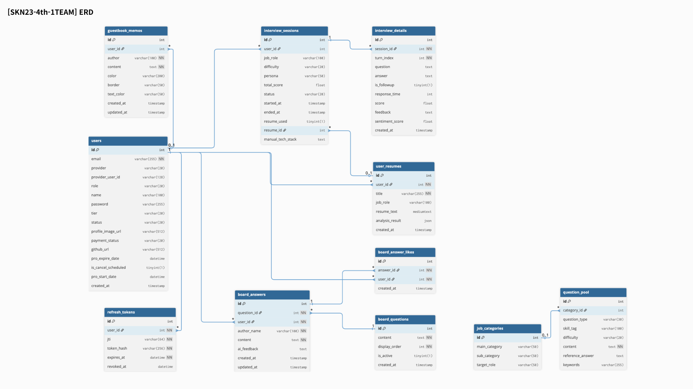

 

# 
 **AIWORK (차세대 AI 주도형 면접 SaaS 플랫폼)** 

</div\>

 

# 1\. 팀 소개

## ✦ 팀 명 : **사자개 물어**

<table style="width: 100%; table-layout: fixed; border-collapse: collapse; text-align: center; font-size: 14px;"\>
<tr\>
<td style="width: 20%; border: 1px solid \#ddd; padding: 0px; vertical-align: middle;"\>

</td\>
<td style="width: 20%; border: 1px solid \#ddd; padding: 0px; vertical-align: middle;"\>

<td style="width: 20%; border: 1px solid \#ddd; padding: 0px; vertical-align: middle;"\>

</td\>
<td style="width: 20%; border: 1px solid \#ddd; padding: 0px; vertical-align: middle;"\>

</td\>
</tr\>
<tr style="background-color: \#f9f9f9; font-weight: bold;"\>
<td style="border: 1px solid \#ddd; padding: 8px;"\>\<strong\>김지우 (팀장)\</strong\>\</td\>
<td style="border: 1px solid \#ddd; padding: 8px;"\>\<strong\>김다빈\</strong\>\</td\>
<td style="border: 1px solid \#ddd; padding: 8px;"\>\<strong\>양창일\</strong\>\</td\>
<td style="border: 1px solid \#ddd; padding: 8px;"\>\<strong\>유헌상\</strong\>\</td\>
</tr\>
<tr\>
<td style="border: 1px solid \#ddd; padding: 8px; color: \#555; word-break: keep-all; text-align: center;"\>
Full-Stack & AI Pipeline\</span\>
</td\>
<td style="border: 1px solid \#ddd; padding: 8px; color: \#555; word-break: keep-all; text-align: center;"\>
역할 입력\</span\>
</td\>
<td style="border: 1px solid \#ddd; padding: 8px; color: \#555; word-break: keep-all; text-align: center;"\>
역할 입력\</span\>
</td\>
<td style="border: 1px solid \#ddd; padding: 8px; color: \#555; word-break: keep-all; text-align: center;"\>
역할 입력\</span\>
</td\>
</tr\>
<tr style="background-color: \#ffffff; font-size: 13px;"\>
<td style="border: 1px solid \#ddd; padding: 8px;"\>
<a href="[https://github.com/jooooww](https://github.com/jooooww)"\>

</a\>
</td\>
<td style="border: 1px solid \#ddd; padding: 8px;"\>
<a href="[https://github.com/tree0327](https://github.com/tree0327)"\>

</a\>
</td\>
<td style="border: 1px solid \#ddd; padding: 8px;"\>
<a href="[https://github.com/clachic00](https://github.com/clachic00)"\>

</a\>
</td\>
<td style="border: 1px solid \#ddd; padding: 8px;"\>
<a href="[https://github.com/hunsang-you](https://github.com/hunsang-you)"\>

</a\>
</td\>
</tr\>
</table\>

  

# 2\. 프로젝트 개요

> *"소프트웨어가 세상을 집어삼키던 시대는 끝났다. 이제 AI가 소프트웨어를 집어삼킬 것이다."*

### ✦ 프로젝트 기획 배경

기존 SaaS 플랫폼은 사용자가 기능을 찾아 직접 클릭하고 학습해야 하는 \*\*'수동적인 도구'\*\*에 불과했습니다. AIWORK는 이러한 한계를 넘어, AI가 사용자의 취업 여정을 먼저 분석하고 리드하는 **'능동적인 파트너'** 역할을 수행하도록 기획되었습니다. 고비용의 1:1 대면 컨설팅을 대체하는 초개인화 AI 면접 경험을 제공합니다.

### ✦ 서비스 소개

**AIWORK**는 표준화된 SaaS 아키텍처 위에 RAG(검색 증강 생성) 기반 AI 면접관을 결합한 서비스입니다. 지원자의 이력서를 분석해 날카로운 압박 꼬리질문을 던지며, Zero-Click 네비게이션과 정밀한 성과 리포트를 통해 사용자의 취업 준비를 완벽하게 돕습니다.

> **프로젝트 기간:** 2026.02.27(금) \~ 2026.03.25(수)

 

# 3\. 비즈니스 모델 & 핵심 전략

**AIWORK**는 AI 경험 가치를 극대화한 B2C 에듀테크 SaaS 모델입니다.

  * **초개인화된 가치 제안:** 이력서 기반 무한 반복 AI 모의 면접, 예상 압박 질문 분석, 직무 매칭률 대시보드 제공
  * **락인 효과 (Lock-in Effect):** 사용자의 면접 기록, 강/약점 데이터가 플랫폼 내 자산으로 축적되어 지속적인 재방문 유도
  * **수익 모델 (Tier System):** 일반(Normal) 회원과 프리미엄(PRO) 회원의 기능 및 접근 권한 차별화

 

# 4\. 프로젝트 핵심 목표

1.  **차세대 AI SaaS 아키텍처 구축:** AI를 단순 부가 기능이 아닌 핵심 엔진으로 배치. (MySQL + ChromaDB Dual Database 구조)
2.  **동적 RAG 면접 파이프라인:** 지원자 이력서 기반의 문맥 검색을 통해 실제 면접관처럼 파고드는 '스마트 AI 꼬리질문' 구현
3.  **환각 현상(Hallucination) 완벽 통제:** 엄격한 JSON Schema와 4대 평가 지표(정확성, 깊이, 구조, 명확성) 기반 실시간 채점 및 오답률 통제
4.  **Seamless UX/UI 구현:** WebRTC 기반 지연 없는 실시간 음성/화상 면접 및 AI 주도형 Zero-Click 화면 이동 환경 구축
5.  **보안 및 인프라 최적화:** 3-Tier 아키텍처를 통한 프록시 분리 및 사용자 민감 정보 차단

 

# 5\. 주요 기능

### 1\. 다중 모드 면접 (Text / Realtime Voice & Vision)

  * **Realtime Voice:** OpenAI Realtime API를 연동하여 지연 없는 음성 대화 환경(STT/TTS) 제공
  * **비언어적 태도 분석:** HuggingFace 랜드마크 모델을 통해 웹캠 기반 얼굴 Feature(시선, 표정 변화 등)를 수치화하여 면접 태도 지표로 도출

### 2\. 하이브리드 문항 출제 & RAG 파이프라인

  * 이력서 기반 맞춤형 돌발 질문(50%) + 직무/난이도 고정 기술 질문(50%) 동적 혼합
  * 업로드된 이력서를 400자 청크 단위로 분할 및 `text-embedding-3-small` 임베딩 후 ChromaDB 적재

### 3\. LangGraph 기반 동적 꼬리질문 제어

  * **턴(Turn) 단위 실시간 채점:** 매 답변을 JSON Schema 기준으로 평가
  * **스마트 꼬리질문:** 답변 점수가 40점 이하일 경우 팩트 체크를 거쳐 최대 2회 심층 꼬리질문 출제 (무한 루프 방지 로직 적용)

### 4\. Zero-Click 에이전트 & 인앱 분석

  * **의도 파악 라우팅:** 가이드 챗봇에 자연어(예: "파이썬 면접 준비해줘") 입력 시 AI가 파라미터를 추출하여 면접장으로 즉시 화면 전환
  * **이력서 퀵 분석:** 챗봇에 문서 첨부 시 STAR 기법 기반 강점 추출 및 즉각적인 마크다운 첨삭 제공

### 5\. 다차원 평가 리포트 시각화

  * 4축 평가 차트(Score Circle) 및 AI 종합 강/약점 분석 피드백 제공
  * html2canvas / jsPDF를 활용한 화면 깨짐 없는 리포트 다운로드 지원

### 6\. 써드파티(Third-party) 연동 및 소셜 로그인

  * **Tavily API:** 최신 면접 트렌드 및 기업 정보 요약 검색 (Web RAG)
  * **고용24 API:** 사용자 관심 직무에 매칭되는 실제 채용 공고 실시간 제공
  * **OAuth 2.0:** Kakao, Google 연동 및 JWT(Access/Refresh) 기반 안전한 세션 관리

 

# 6\. 프로젝트 설계

## ✦ 시스템 아키텍쳐

</div\>

## ✦ 데이터베이스 구조 (ERD)

</div\>

## ✦ LLM 추론 파이프라인

1.  **면접 세팅 및 Ingestion:** 프론트엔드 파라미터 수집 ➔ RDBMS 세션 생성 ➔ Vector DB 이력서 임베딩
2.  **다중 모드 실행:** 채팅 또는 WebRTC(음성/비전)를 통해 LangGraph 추론 엔진 호출
3.  **하이브리드 추론 (Core):** RAG 팩트 체크 + 직무 기술 문항 혼합 ➔ 실시간 4축 평가 ➔ 환각 제어 꼬리질문 생성 ➔ DB 트랜잭션 기록
4.  **결과 분석:** 세션 종료 시 종합 로그 분석 ➔ 마크다운 리포트 생성 및 React 렌더링

 

# 7\. 기술 스택

  * **Frontend:** \ \ \ \
  * **Backend:** \ \ \
  * **AI & LLM:** \ \ \
  * **Database/Infra:** \ \ \

 

# 8\. Version 2.0 고도화 포인트 (vs 3차 프로젝트)

| 구분 | V 1.0 (3차 프로젝트) | V 2.0 (현 4차 프로젝트) | 기술적 고도화 성과 |
| :--- | :--- | :--- | :--- |
| **Frontend** | Streamlit (Python 렌더링) | **React + TS + Zustand** | 잦은 화면 새로고침(Re-run) 탈피, 단방향 렌더링 및 완벽한 **SPA 기반 UX 혁신** |
| **Backend** | 단일 FastAPI | **Django + FastAPI 하이브리드** | 비동기 추론(FastAPI)과 안정적인 인증/CRUD(Django) 역할을 분리하여 **서버 안정성 극대화** |
| **AI State** | 무한 꼬리질문 버그 | **StateGraph 동적 제어** | `follow_up_count` 상태를 추적하여 오답 시에도 **최대 2회로 꼬리질문 루프 강제 차단** |
| **Q-Mixer** | 기획 단계 (TODO) | **RAG + DB 50:50 동적 병합** | ChromaDB의 이력서 청크와 MySQL 기술 문항을 실제 코드로 동적 믹싱 출제 구현 |
| **Auth Flow** | 컴포넌트별 개별 검증 | **Zustand 전역 Intercept** | `LoginModal` 단일 컨트롤러 구축으로 권한 밖의 접근을 우아하게(Graceful) 차단 및 라우팅 제어 |

 

# 9\. 트러블 슈팅 (Trouble Shooting)

### ✦ AI 동문서답 현상 (RAG 연동 오류)

  * **문제:** 이력서를 첨부해도 일반적인 기술 질문만 출제됨.
  * **해결:** 레거시 API 라우터 통신 시 누락되던 `session_id` 페이로드를 수정하고, 최신 RAG 평가 엔진으로 통신 경로를 일원화하여 맞춤형 꼬리질문 정상 작동 확보.

### ✦ 무한 로딩 및 조용한 에러(Silent Failure) 방어

  * **문제:** 채팅 전송 시 백엔드 파라미터 누락(422 에러)이 발생해도 UI가 강제 새로고침되어 원인 파악이 불가함.
  * **해결:** API 호출 함수 리턴을 Boolean으로 변경하여 통신 실패 시 UI 렌더링을 차단하는 **방어적 프로그래밍(Defensive Programming)** 적용.

### ✦ AI 면접 문항 편향성 문제

  * **문제:** 이력서 첨부 시 경험 위주로만 질문이 치우쳐 하드 스킬(CS 등) 검증이 누락됨.
  * **해결:** 이력서 기반 경험 질문 50% + MySQL 적재 고정 기술 질문 50%가 혼합 출제되도록 하이브리드 출제 알고리즘 리팩터링.

### ✦ 전역 상태 관리를 통한 Auth Flow 일원화

  * **문제:** 로그인 없이 보호된 기능 접근 시 산발적인 alert 창과 튕김 현상 발생.
  * **해결:** React Zustand(`useAuthStore`)를 활용하여 앱 전역에서 인증 상태를 감지하고, 권한 필요 시 공통 `LoginModal`을 띄워 흐름을 가로채는 중앙 집중화 아키텍처 구축.

 

# 10\. 향후 개선 계획 (Scale-up)

  * **B2B 엔터프라이즈 확장:** 기업 인사담당자 전용 대시보드를 추가하여 지원자 역량 랭킹 보드를 제공하는 B2B HR 솔루션으로 진화
  * **멀티모달 오디오 분석:** 목소리 떨림, 발화 속도(Pace), 피치(Pitch) 등을 추가 분석하여 감정 및 긴장도 수치화 고도화
  * **특수 도메인 sLLM 연동:** 의료, 금융 등 전문 지식에 파인튜닝(Fine-tuning)된 소형 모델을 병렬 연동하여 면접 전문성 강화

 

# 11\. Insight & 팀 회고

> **"진정한 AI SaaS는 UI에 챗봇 하나 띄워두는 것이 아니다."**

기존에는 도구형 기능에 AI를 보조 수단으로 붙였다면, 이번 프로젝트는 **AI(RAG 엔진과 평가 로직)를 서비스의 심장부로 설계하고 그 위에 SaaS 구조(계정 관리, 결제, 대시보드)를 쌓아 올리는 패러다임 전환**을 경험했습니다. 프론트엔드의 매끄러운 상태 관리와 백엔드의 복잡한 AI 추론 로직 간의 완벽한 분리가 서비스 완성도의 핵심임을 깊이 깨달았습니다.

  * **김지우 (팀장):** -
  * **김다빈 (팀원):** -
  * **양창일 (팀원):** -
  * **유헌상 (팀원):** -